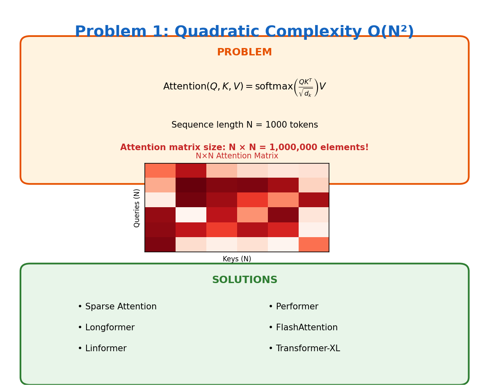

# Problem 1: Quadratic Complexity O(N²)

[← Back to Main](../README.md) | [Next: Positional Awareness →](../02_positional_awareness/README.md)

---



## What's the Problem?

Here's the deal with transformers: every token needs to "look at" every other token. If you have a sentence with 1000 words, that's 1000 × 1000 = 1 million attention calculations. Double your sequence length? You've just quadrupled your compute.

The math is simple but brutal:
- 1K tokens → 1M operations
- 10K tokens → 100M operations  
- 100K tokens → 10B operations

This is why early models like GPT-2 were stuck at 1024 tokens. It's not that researchers didn't want longer contexts — the math just didn't work.

## Why Does This Happen?

The self-attention formula looks innocent enough:

```
Attention(Q, K, V) = softmax(QK^T / √d_k) V
```

But that `QK^T` part? That's where you're multiplying a (N × d) matrix by a (d × N) matrix, giving you an (N × N) attention matrix. Every. Single. Layer.

## How Do We Fix It?

| Approach | The Idea |
|----------|----------|
| **Sparse Attention** | Don't compute all N² pairs — use patterns (local windows, strided, etc.) |
| **Longformer** | Sliding window + global tokens for important positions |
| **Linformer** | Project K and V to lower dimensions first |
| **Performer** | Approximate softmax with random features (FAVOR+) |
| **FlashAttention** | Same math, but way smarter memory access patterns |
| **Transformer-XL** | Process in segments, reuse previous computations |

## Learn More

- [Attention Is All You Need](https://arxiv.org/abs/1706.03762) — The original paper
- [Longformer](https://arxiv.org/abs/2004.05150) — Efficient attention for long documents
- [FlashAttention](https://arxiv.org/abs/2205.14135) — The IO-aware approach everyone uses now

---

[← Back to Main](../README.md) | [Next: Positional Awareness →](../02_positional_awareness/README.md)
