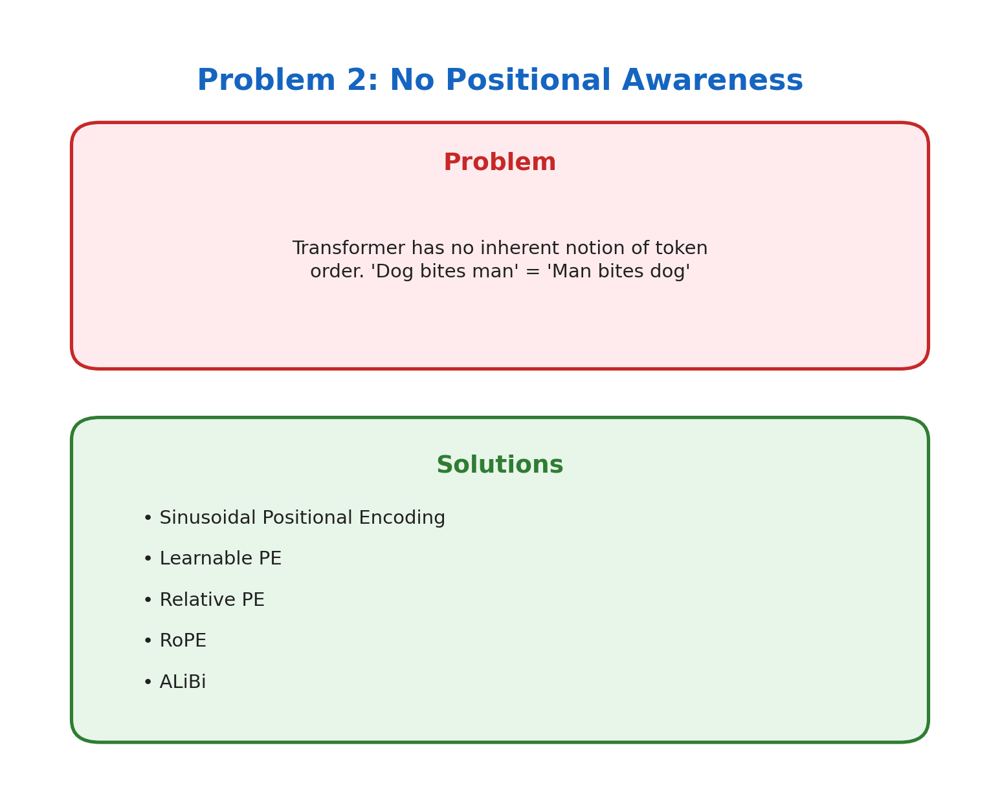

# Problem 2: No Positional Awareness

[← Back to Main](../README.md) | [← Previous](../01_quadratic_complexity/README.md) | [Next →](../03_fixed_context/README.md)

---



## What's the Problem?

Try this: shuffle the words in "The dog bit the man" to get "man the bit dog The". To a vanilla transformer, these are literally the same thing. It has no idea which word came first.

Why? Because self-attention is **permutation invariant**. It just looks at the content of each token and how they relate to each other — position doesn't factor in at all.

This is actually by design (parallelization!), but it means we need to explicitly tell the model about order.

## Why Does This Happen?

Unlike RNNs that process words one-by-one (so position is implicit), transformers see all tokens simultaneously. The attention mechanism computes:

```
attention_score = query · key
```

Nothing in this equation cares about *where* the query or key came from in the sequence.

## How Do We Fix It?

We inject position information directly into the embeddings:

| Method | How It Works |
|--------|--------------|
| **Sinusoidal PE** | Add sin/cos waves at different frequencies — position 1 gets one pattern, position 2 gets another |
| **Learned PE** | Let the model learn a vector for each position during training |
| **Relative PE** | Instead of absolute positions, encode *distances* between tokens |
| **RoPE** | Rotate embedding vectors based on position — mathematically elegant |
| **ALiBi** | Add a bias to attention scores based on distance — no extra parameters! |

## The Trade-offs

- **Sinusoidal**: Works okay, but doesn't generalize well to longer sequences
- **Learned**: Great for fixed lengths, but what about position 10001 if you only trained up to 10000?
- **RoPE/ALiBi**: These actually extrapolate reasonably well to unseen lengths

## Learn More

- [RoFormer Paper](https://arxiv.org/abs/2104.09864) — Where RoPE comes from
- [ALiBi Paper](https://arxiv.org/abs/2108.12409) — Train short, test long

---

[← Back to Main](../README.md) | [← Previous](../01_quadratic_complexity/README.md) | [Next →](../03_fixed_context/README.md)
