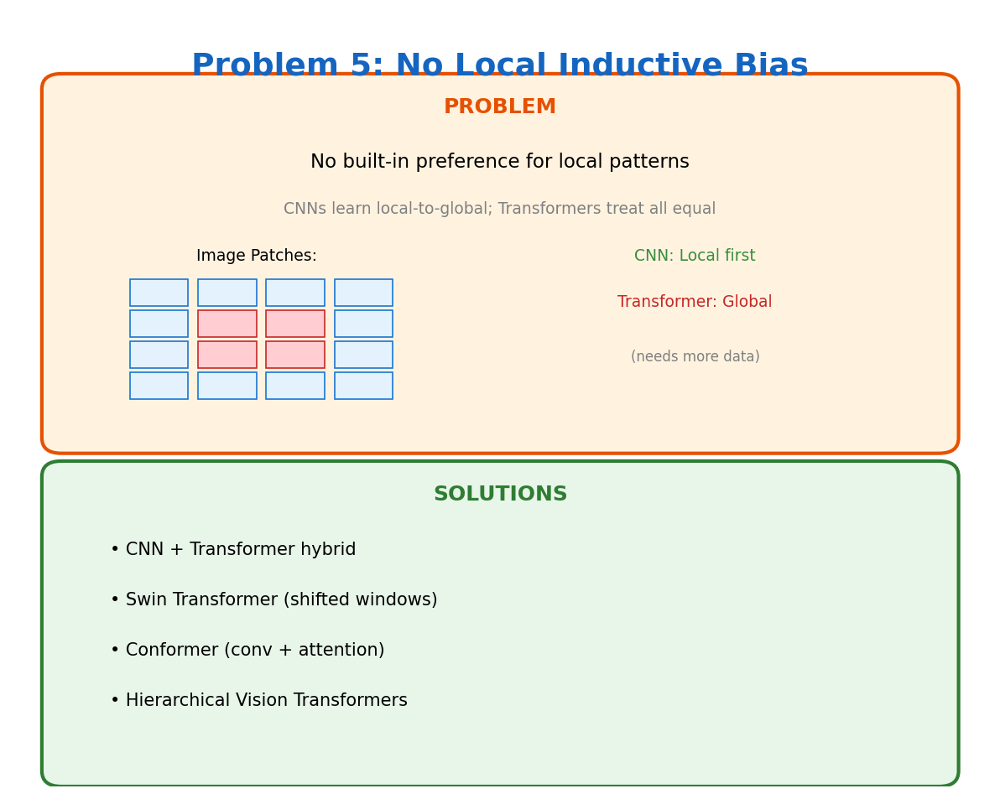

# Problem 5: No Local Inductive Bias

[← Back to Main](../README.md) | [← Previous](../04_slow_decoding/README.md) | [Next →](../06_data_hungry/README.md)

---



## What's the Problem?

When you look at an image, nearby pixels usually mean more than distant ones. A cat's ear pixels relate strongly to nearby fur pixels, not so much to the background sky.

CNNs "get" this naturally — convolutions are local by design. Transformers? They treat position 1 and position 1000 with equal importance. Every token can attend to every other token equally.

For images, this means ViT needs way more data than CNNs to learn that "nearby stuff matters more."

## Why Does This Happen?

Self-attention computes:
```
attention(i, j) = softmax(q_i · k_j)
```

Notice anything missing? There's no concept of distance between positions i and j. The model has to *learn* that nearby positions are often more relevant — it doesn't come for free.

## Why Local Bias Helps

In many domains, there's inherent locality:
- **Images**: Objects are spatially coherent
- **Audio**: Adjacent frames are related
- **Text**: Nearby words form phrases

Starting with this assumption (inductive bias) lets models learn faster with less data.

## How Do We Fix It?

| Approach | The Idea |
|----------|----------|
| **CNN + Transformer** | Use conv layers early (local), attention later (global) |
| **Swin Transformer** | Attention only within local windows, shift windows between layers |
| **Conformer** | Interleave convolution and attention blocks |
| **Hierarchical ViT** | Start with small patches, merge them progressively |

## The Hybrid Approach Works

Most state-of-the-art vision models now combine both:
- Convolutions capture local patterns efficiently
- Attention captures global relationships

Best of both worlds.

## Learn More

- [Swin Transformer](https://arxiv.org/abs/2103.14030) — Shifted windows
- [ConvNeXt](https://arxiv.org/abs/2201.03545) — Modernized CNNs compete with transformers

---

[← Back to Main](../README.md) | [← Previous](../04_slow_decoding/README.md) | [Next →](../06_data_hungry/README.md)
