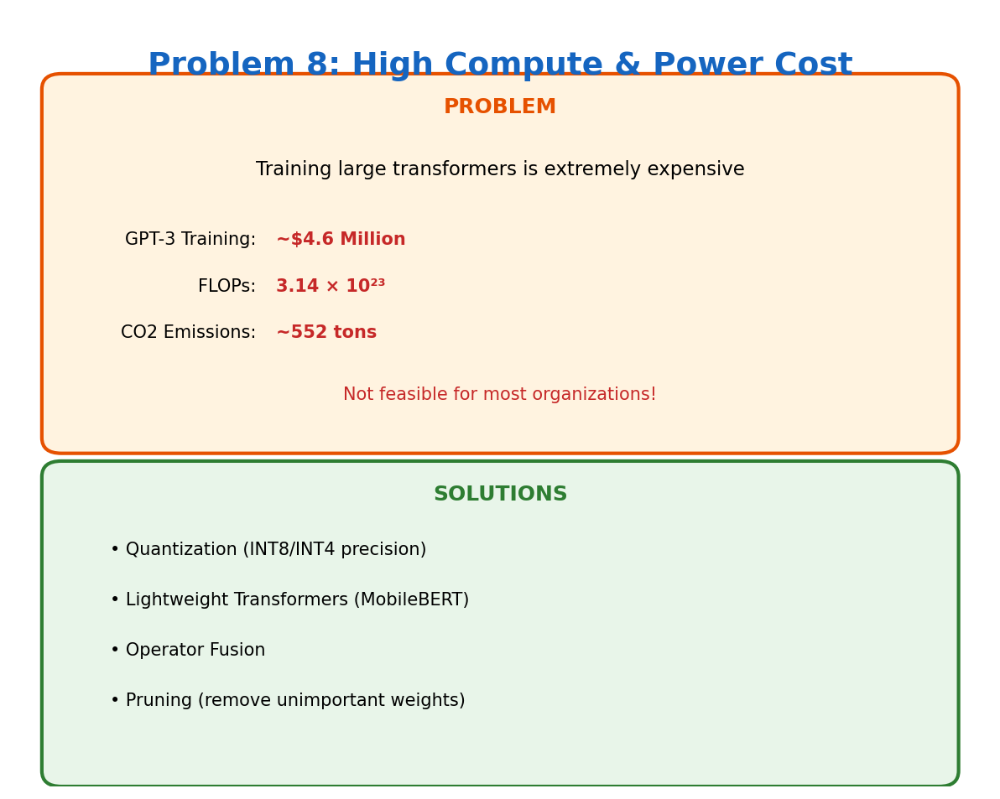

# Problem 8: High Compute & Power Cost

[← Back to Main](../README.md) | [← Previous](../07_memory_footprint/README.md) | [Next →](../09_length_generalization/README.md)

---

## What's the Problem?

Training GPT-3 cost an estimated $4.6 million in compute. GPT-4? Probably $50-100 million. And that's just training once — experiments, failed runs, and hyperparameter tuning multiply this.

The environmental cost is real too. Training a single large model can emit as much CO2 as five cars over their entire lifetimes.

This isn't just an inconvenience — it means:
- Only a handful of companies can train frontier models
- Iteration is slow and expensive
- Smaller research labs are locked out

## The Numbers

| Model | Training Cost | FLOPs | CO2 |
|-------|--------------|-------|-----|
| BERT-base | ~$1,000 | 10^18 | ~30kg |
| GPT-3 | ~$4.6M | 3.14×10^23 | ~552 tons |
| PaLM | ~$10M+ | 10^24 | ~1000+ tons |

## Why So Expensive?

Every forward pass through a transformer involves:
- Matrix multiplications (compute-heavy)
- Attention (O(N²) for sequence length N)
- Billions of these operations per training step
- Millions of training steps

And you need this on expensive hardware (A100s at ~$10K each, H100s at ~$30K each).

## How Do We Fix It?

| Approach | Savings |
|----------|---------|
| **Quantization** | Run in INT8/INT4 instead of FP16/32 — 2-4x speedup |
| **Pruning** | Remove unimportant weights — 50-90% sparsity possible |
| **Distillation** | Train small models to mimic big ones |
| **Efficient Architectures** | MobileBERT, DistilBERT — designed for efficiency |
| **Mixture of Experts** | Only activate subset of parameters per input |

## The MoE Revolution

Mixture of Experts models (like Mixtral) have many parameters but only activate a fraction per token. A 47B parameter model might only use 13B per forward pass.

More capacity, less compute. Best of both worlds.

## Learn More

- [LLM.int8()](https://arxiv.org/abs/2208.07339) — Quantization that works
- [Chinchilla](https://arxiv.org/abs/2203.15556) — Compute-optimal training

---

[← Back to Main](../README.md) | [← Previous](../07_memory_footprint/README.md) | [Next →](../09_length_generalization/README.md)
