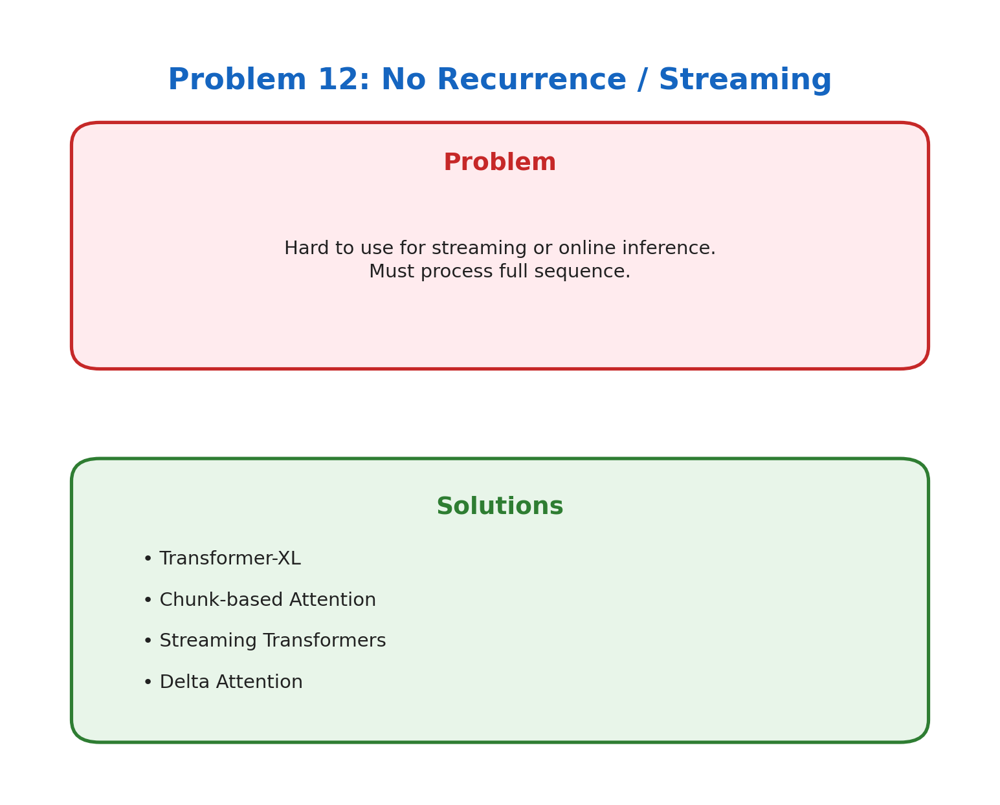

# Problem 12: No Recurrence / Streaming

[← Back to Main](../README.md) | [← Previous](../11_attention_smoothing/README.md) | [Next →](../13_model_size/README.md)

---



## What's the Problem?

Someone's talking to you. You want to transcribe it in real-time. But your transformer needs the *entire* utterance before it can process anything.

Transformers fundamentally need to see all tokens to compute attention. Token 50 attends to token 1, so you can't process token 50 until token 1 exists. This makes streaming applications tricky:

- Real-time transcription
- Live translation  
- Voice assistants
- Gaming NPCs

Users don't want to wait 10 seconds for a response in a conversation.

## Why Does This Happen?

Self-attention computes:
```
Attention(i) = softmax(q_i · K) · V
```

Notice that every query looks at ALL keys. For token 50 to compute attention, keys for tokens 1-49 must exist. No shortcuts.

RNNs didn't have this problem — they process one token at a time, maintaining a hidden state. Transformers traded recurrence for parallelism.

## How Do We Fix It?

| Approach | How It Works |
|----------|--------------|
| **Transformer-XL** | Process in segments, pass hidden states between segments |
| **Chunked Attention** | Process fixed-size chunks, use cross-attention between chunks |
| **Streaming Transformers** | Causal attention with lookback window |
| **Delta Attention** | Incrementally update attention when new tokens arrive |
| **State Space Models** | Mamba/S4 — RNN-like recurrence with parallel training |

## The SSM Alternative

State Space Models (like Mamba) bring back recurrence but keep parallel training:
- Training: Process all tokens in parallel (like transformers)
- Inference: Process one token at a time with constant memory (like RNNs)

This makes them naturally suited for streaming.

## Practical Streaming Today

Most "streaming" LLM applications use a simple trick:
1. Wait for a pause in speech
2. Process the chunk
3. Output result
4. Continue

Not true streaming, but good enough for most use cases.

## Learn More

- [Transformer-XL](https://arxiv.org/abs/1901.02860) — Segment-level recurrence
- [Mamba](https://arxiv.org/abs/2312.00752) — The SSM approach

---

[← Back to Main](../README.md) | [← Previous](../11_attention_smoothing/README.md) | [Next →](../13_model_size/README.md)
