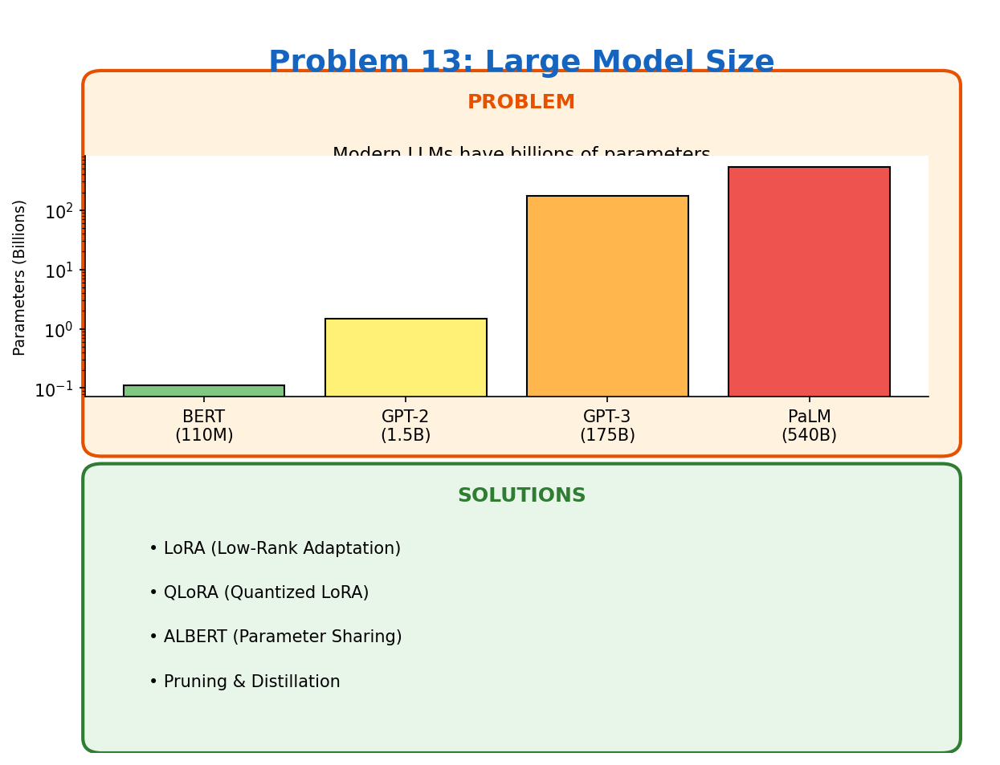

# Problem 13: Large Model Size

[← Back to Main](../README.md) | [← Previous](../12_no_recurrence/README.md) | [Next →](../14_noise_sensitivity/README.md)

---

## What's the Problem?

GPT-3 has 175 billion parameters. At 2 bytes per parameter (FP16), that's 350GB just for the weights. Good luck fitting that on your laptop.

The trend is clear:
- BERT (2018): 110M parameters
- GPT-2 (2019): 1.5B parameters
- GPT-3 (2020): 175B parameters
- PaLM (2022): 540B parameters

Bigger models generally perform better, but they're impossible to deploy in many settings:
- Mobile devices
- Edge computing
- Low-cost servers
- Real-time applications

## Why So Big?

Two reasons models keep growing:

1. **Scaling laws**: Performance reliably improves with more parameters (given enough data and compute)

2. **Emergent abilities**: Some capabilities only appear at certain scales — you can't get them from small models

The "bitter lesson" is that scale beats clever algorithms, at least so far.

## The Deployment Problem

| Model | Size (FP16) | Can Run On |
|-------|-------------|------------|
| DistilBERT | 250MB | Phone |
| LLaMA-7B | 14GB | Gaming GPU |
| LLaMA-70B | 140GB | 2x A100 |
| GPT-4 | ~1TB? | Data center only |

## How Do We Fix It?

| Technique | What It Does |
|-----------|--------------|
| **LoRA** | Only train small adapter matrices, freeze the rest |
| **QLoRA** | LoRA + 4-bit quantization — fine-tune 70B on a single GPU |
| **ALBERT** | Share parameters across layers — same depth, fewer parameters |
| **Pruning** | Remove weights that don't contribute much |
| **Distillation** | Train a small model to mimic a big one |

## LoRA: The Game Changer

Instead of updating all 7 billion parameters, LoRA:
1. Freezes the pretrained weights
2. Adds small "adapter" matrices (rank 8-64)
3. Only trains these adapters

A 7B model needs 14GB normally. With LoRA, you add maybe 10-50MB of trainable parameters. Fine-tuning becomes possible on consumer hardware.

## Learn More

- [LoRA Paper](https://arxiv.org/abs/2106.09685)
- [QLoRA Paper](https://arxiv.org/abs/2305.14314)
- [ALBERT](https://arxiv.org/abs/1909.11942)

---

[← Back to Main](../README.md) | [← Previous](../12_no_recurrence/README.md) | [Next →](../14_noise_sensitivity/README.md)
