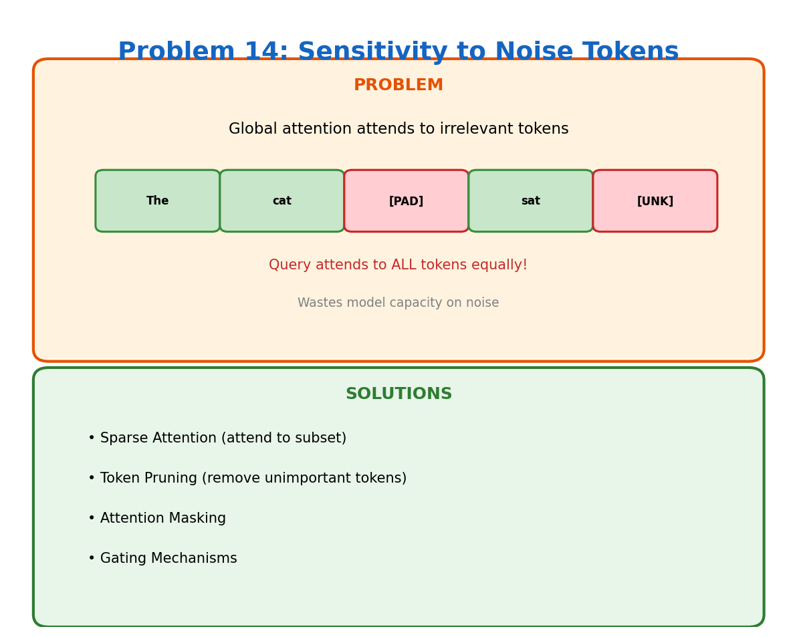

# Problem 14: Sensitivity to Noise Tokens

[← Back to Main](../README.md) | [← Previous](../13_model_size/README.md) | [Next →](../15_interpretability/README.md)

---



## What's the Problem?

Your input has 1000 tokens. 900 are relevant content. 100 are noise — padding tokens, formatting artifacts, irrelevant context. 

A transformer doesn't know the difference. It computes attention from every token to every other token, including the noise. This wastes computation and can hurt performance as the model gets distracted by irrelevant information.

Common noise sources:
- Padding tokens (to make batches uniform)
- HTML/markdown artifacts
- Repeated delimiters
- Irrelevant retrieved context (in RAG)

## Why Does This Happen?

Global attention means every query attends to every key:
```
attention = softmax(Q @ K.T) @ V
```

The model has to *learn* to ignore noise. But:
1. This takes up model capacity
2. It's not always successful
3. Noisy tokens still consume compute

## A Real Example

Input: "The cat [PAD] [PAD] [PAD] sat on [UNK] the mat [PAD] [PAD]"

The model computes attention to all 11 tokens, but only 6 carry meaning. 45% of attention computation is wasted on noise.

## How Do We Fix It?

| Approach | What It Does |
|----------|--------------|
| **Attention Masking** | Explicitly mask out padding/noise tokens |
| **Sparse Attention** | Only attend to a subset of tokens |
| **Token Pruning** | Remove unimportant tokens mid-computation |
| **Gating Mechanisms** | Learn to weight down irrelevant tokens |
| **Better Tokenization** | Reduce noise at the source |

## Attention Masks

The standard solution is attention masking:
```python
attention_scores = Q @ K.T
attention_scores[mask == 0] = -inf  # These become 0 after softmax
attention = softmax(attention_scores) @ V
```

Masked tokens get zero attention weight. But you're still computing scores for them — just throwing them away.

## Dynamic Token Pruning

More advanced approaches actually remove tokens:
1. After layer N, score each token's importance
2. Drop the bottom 50%
3. Continue with half the tokens

This gives quadratic speedups (half tokens = quarter attention compute).

## Learn More

- [Sparse Transformers](https://arxiv.org/abs/1904.10509)
- [Token Merging (ToMe)](https://arxiv.org/abs/2210.09461)

---

[← Back to Main](../README.md) | [← Previous](../13_model_size/README.md) | [Next →](../15_interpretability/README.md)
