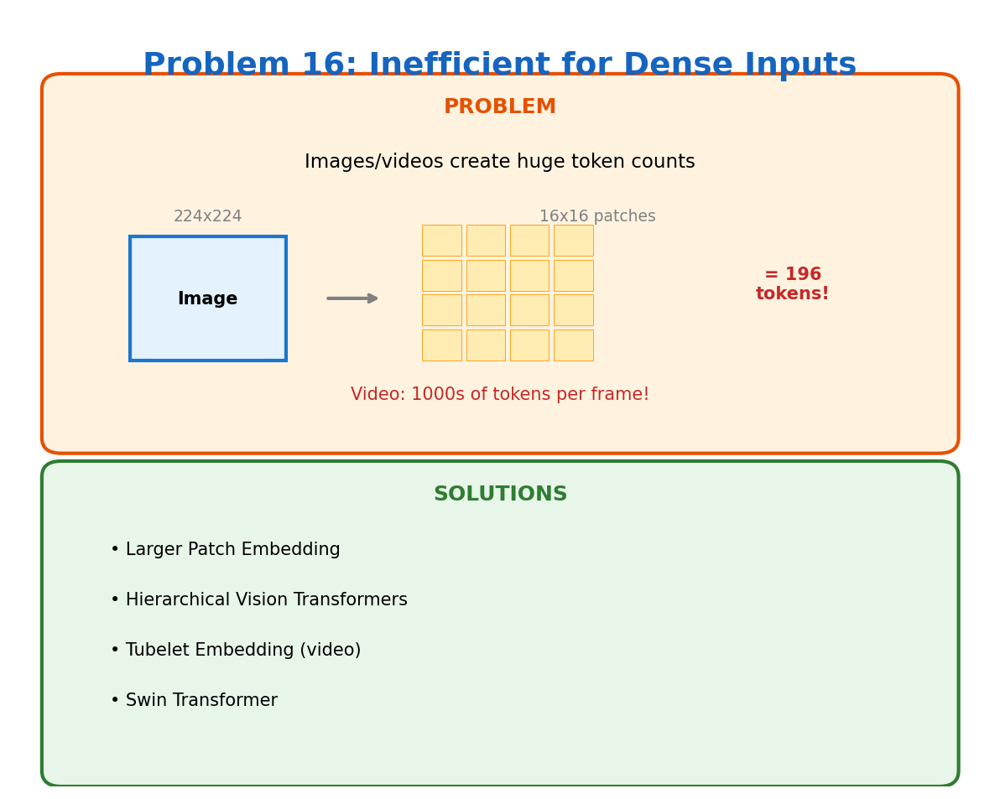

# Problem 16: Inefficient for Dense Inputs

[← Back to Main](../README.md) | [← Previous](../15_interpretability/README.md) | [Next →](../17_hardware_inefficiency/README.md)

---

## What's the Problem?

Text is sparse — a few hundred tokens for a paragraph. Images are dense — a 224×224 image has 50,176 pixels.

To use a transformer on an image, you have to flatten it into a sequence. ViT uses 16×16 patches, giving you 196 tokens for a 224×224 image. Higher resolution? More tokens. Video? Way more tokens.

| Input | Resolution | Tokens (16×16 patches) |
|-------|------------|------------------------|
| Image | 224×224 | 196 |
| Image | 512×512 | 1024 |
| Image | 1024×1024 | 4096 |
| Video (1 sec) | 224×224 @ 30fps | 5880 |

Remember O(N²) attention? Now you see the problem.

## Why Can't We Use Smaller Patches?

Smaller patches = more detail = better performance. But also = more tokens = quadratic blowup.

32×32 patches on a 224×224 image: 49 tokens. Great for compute, but you lose fine details.

8×8 patches: 784 tokens. Better quality, but 16x more attention compute than 32×32.

## How Do We Fix It?

| Approach | What It Does |
|----------|--------------|
| **Larger Patches** | Trade detail for efficiency |
| **Hierarchical ViT** | Start with small patches, merge them as you go deeper |
| **Swin Transformer** | Local attention within windows, shift windows between layers |
| **Tubelet Embedding** | For video — embed 3D chunks (space + time) |
| **Token Pruning** | Drop less important patches mid-network |

## Swin: The Winning Design

Swin Transformer computes attention only within local windows (e.g., 7×7 patches). Then it shifts the windows to allow cross-window communication.

Benefits:
- Linear complexity with image size (not quadratic)
- Maintains ability to capture global context
- Hierarchical features like CNNs

This is why Swin became the go-to for vision tasks.

## Video is Harder

Video = images × time. Even with tricks, processing a 10-second video at 30fps is:
- 300 frames × 196 patches = 58,800 tokens

Solutions involve heavy temporal downsampling, 3D patch embeddings, or processing frames independently.

## Learn More

- [ViT](https://arxiv.org/abs/2010.11929) — The original vision transformer
- [Swin](https://arxiv.org/abs/2103.14030) — Hierarchical vision transformer
- [Video Swin](https://arxiv.org/abs/2106.13230) — Extension to video

---

[← Back to Main](../README.md) | [← Previous](../15_interpretability/README.md) | [Next →](../17_hardware_inefficiency/README.md)
