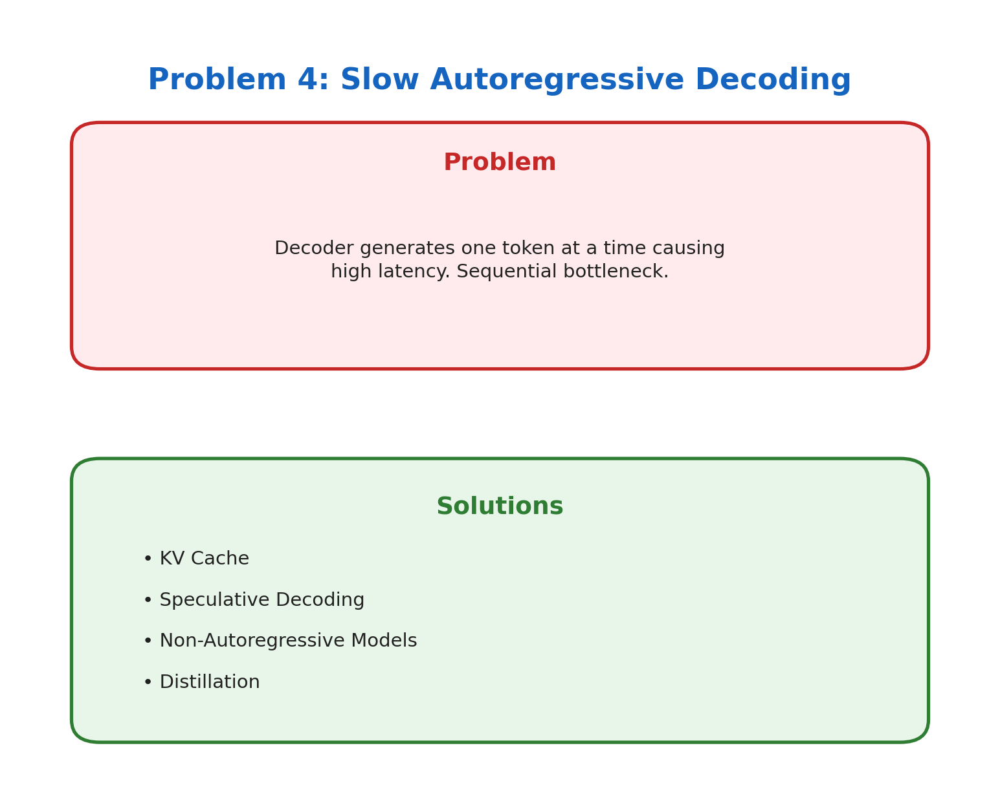
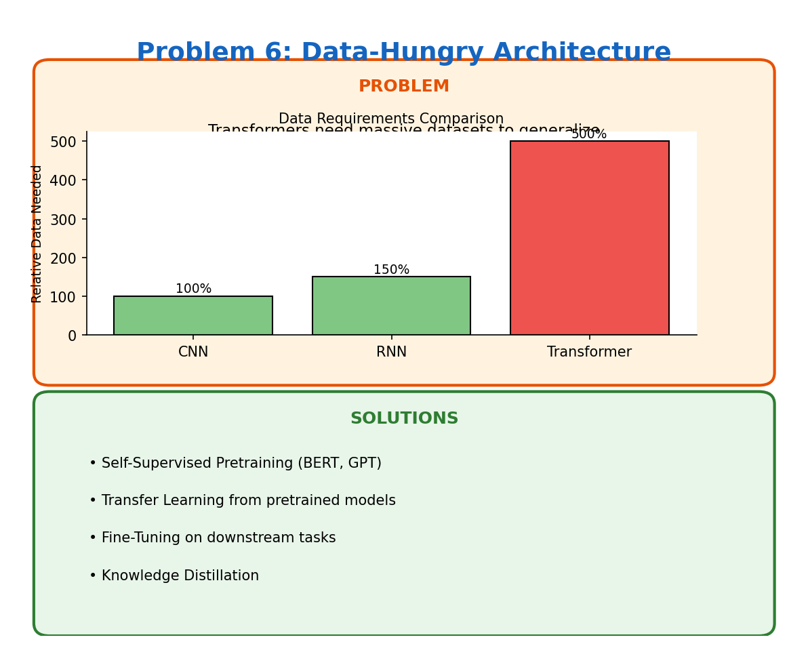
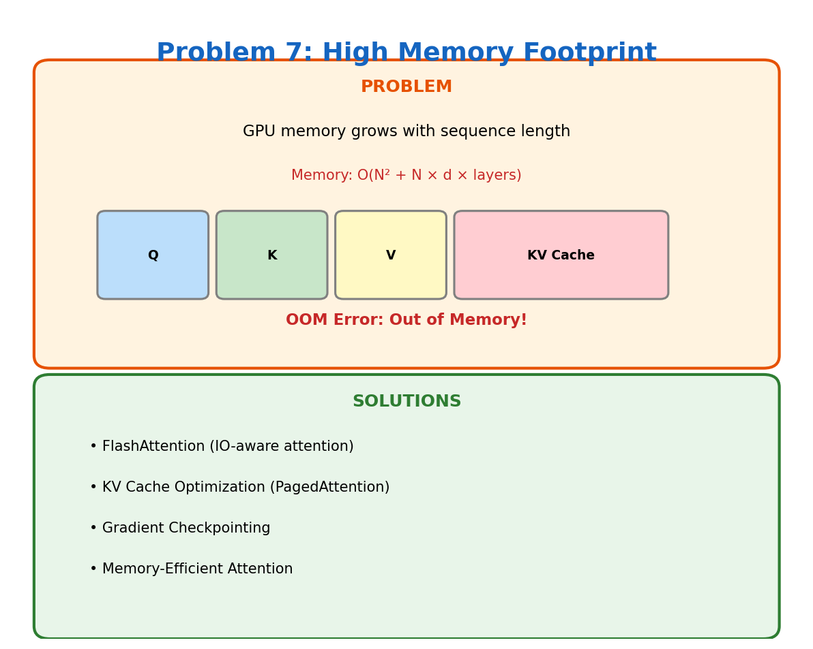
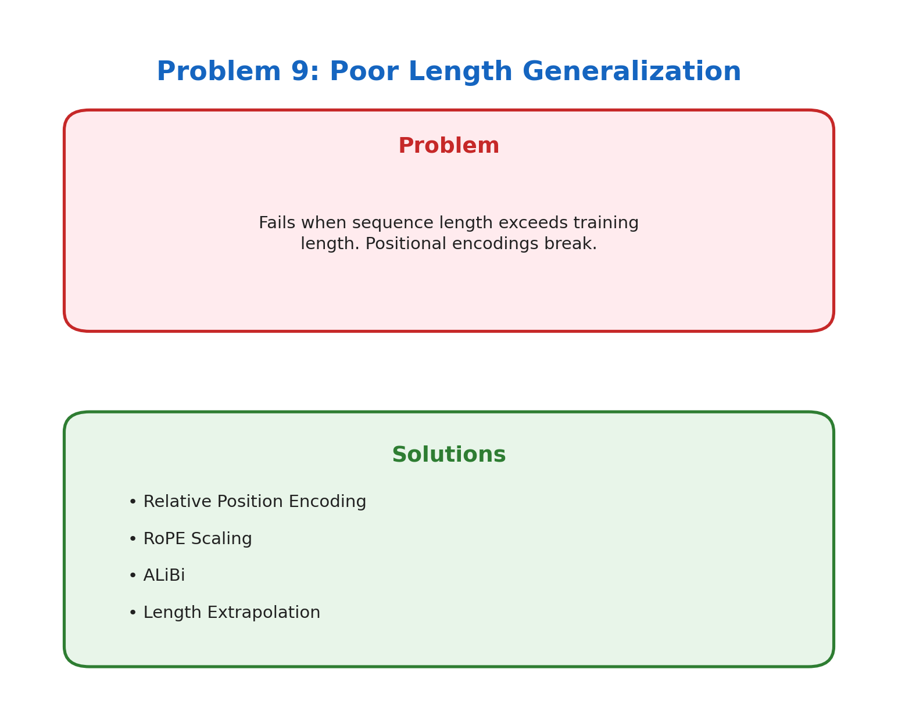
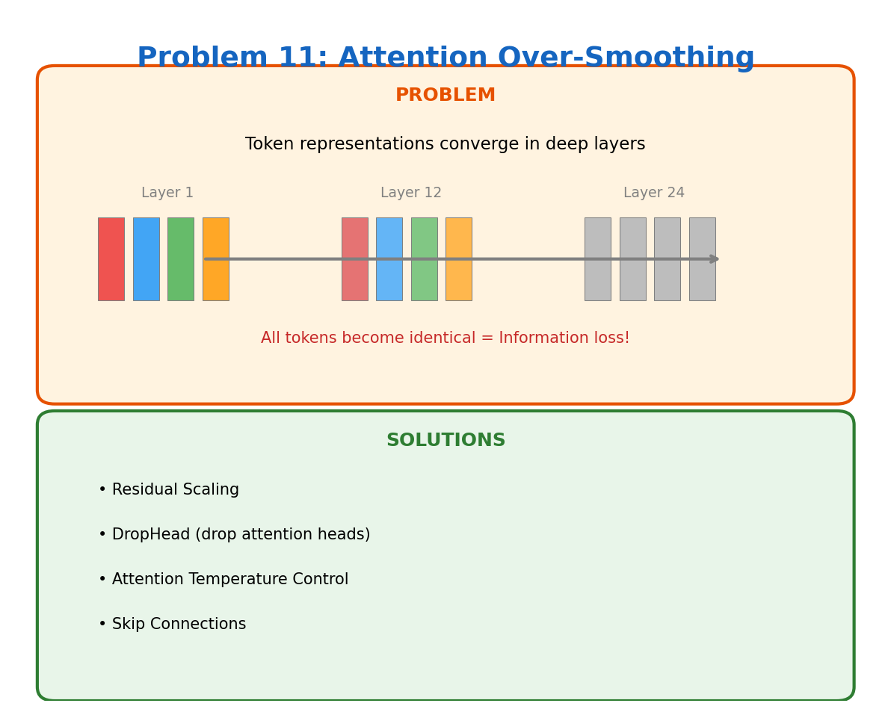
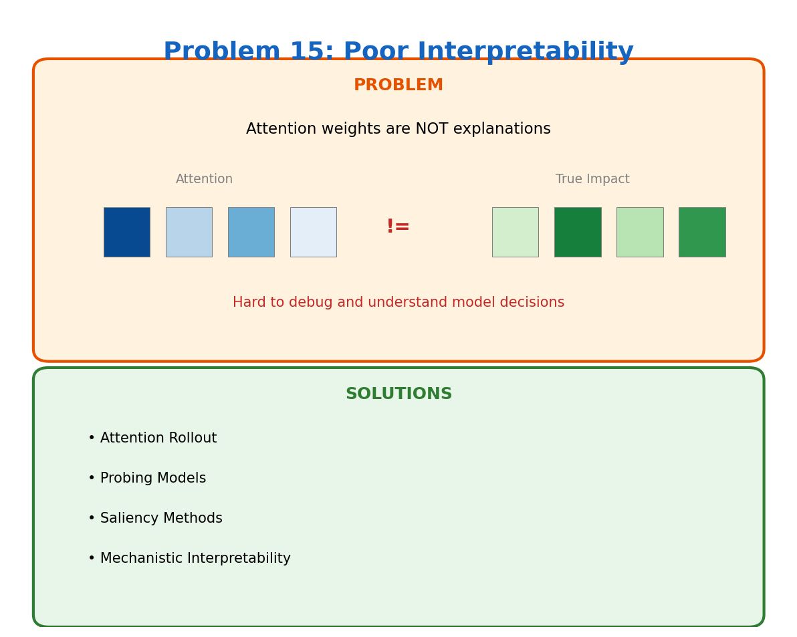
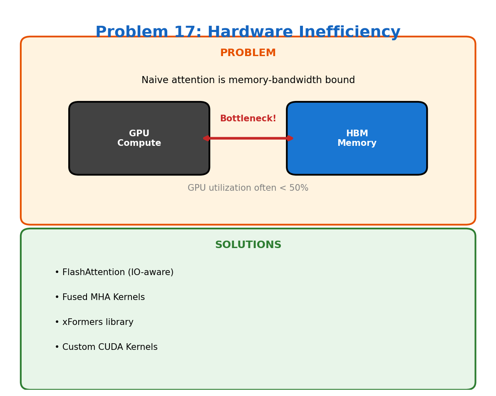
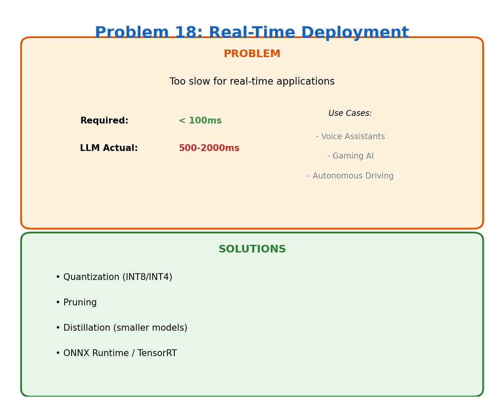

# 🤖 Transformer Problems

A comprehensive collection documenting **18 key limitations** of the Transformer architecture and their solutions.

Each problem includes a visual infographic and detailed documentation with references to relevant research papers.

---

## 📋 Table of Contents

| # | Problem | Category |
|---|---------|----------|
| [01](#01-quadratic-complexity-on²) | Quadratic Complexity O(N²) | Efficiency |
| [02](#02-no-positional-awareness) | No Positional Awareness | Architecture |
| [03](#03-fixed-context-window) | Fixed Context Window | Memory |
| [04](#04-slow-autoregressive-decoding) | Slow Autoregressive Decoding | Inference |
| [05](#05-no-local-inductive-bias) | No Local Inductive Bias | Architecture |
| [06](#06-data-hungry-architecture) | Data-Hungry Architecture | Training |
| [07](#07-high-memory-footprint) | High Memory Footprint | Efficiency |
| [08](#08-high-compute--power-cost) | High Compute & Power Cost | Efficiency |
| [09](#09-poor-length-generalization) | Poor Length Generalization | Generalization |
| [10](#10-training-instability) | Training Instability | Training |
| [11](#11-attention-over-smoothing) | Attention Over-Smoothing | Architecture |
| [12](#12-no-recurrence--streaming) | No Recurrence / Streaming | Architecture |
| [13](#13-large-model-size) | Large Model Size | Deployment |
| [14](#14-sensitivity-to-noise-tokens) | Sensitivity to Noise Tokens | Robustness |
| [15](#15-poor-interpretability) | Poor Interpretability | Explainability |
| [16](#16-inefficient-for-dense-inputs) | Inefficient for Dense Inputs | Vision/Video |
| [17](#17-hardware-inefficiency) | Hardware Inefficiency | Efficiency |
| [18](#18-real-time-deployment) | Real-Time Deployment | Deployment |

---

## 🔍 Problems Overview

### 01. Quadratic Complexity O(N²)


📁 [View Details](./01_quadratic_complexity/)

---

### 02. No Positional Awareness


📁 [View Details](./02_positional_awareness/)

---

### 03. Fixed Context Window


📁 [View Details](./03_fixed_context/)

---

### 04. Slow Autoregressive Decoding



📁 [View Details](./04_slow_decoding/)

---

### 05. No Local Inductive Bias


📁 [View Details](./05_local_bias/)

---

### 06. Data-Hungry Architecture



📁 [View Details](./06_data_hungry/)

---

### 07. High Memory Footprint



📁 [View Details](./07_memory_footprint/)

---

### 08. High Compute & Power Cost


📁 [View Details](./08_compute_cost/)

---

### 09. Poor Length Generalization



📁 [View Details](./09_length_generalization/)

---

### 10. Training Instability


📁 [View Details](./10_training_instability/)

---

### 11. Attention Over-Smoothing



📁 [View Details](./11_attention_smoothing/)

---

### 12. No Recurrence / Streaming


📁 [View Details](./12_no_recurrence/)

---

### 13. Large Model Size


📁 [View Details](./13_model_size/)

---

### 14. Sensitivity to Noise Tokens


📁 [View Details](./14_noise_sensitivity/)

---

### 15. Poor Interpretability



📁 [View Details](./15_interpretability/)

---

### 16. Inefficient for Dense Inputs


📁 [View Details](./16_dense_inputs/)

---

### 17. Hardware Inefficiency



📁 [View Details](./17_hardware_inefficiency/)

---

### 18. Real-Time Deployment



📁 [View Details](./18_realtime_deployment/)

---

## 🛠️ Generate Images

To regenerate all infographic images, run:

```bash
python generate_images.py
```

Requirements:
- Python 3.7+
- matplotlib

---

## 📚 Key References

- [Attention Is All You Need](https://arxiv.org/abs/1706.03762) - Original Transformer paper
- [BERT](https://arxiv.org/abs/1810.04805) - Bidirectional Encoder Representations
- [GPT-3](https://arxiv.org/abs/2005.14165) - Language Models are Few-Shot Learners
- [FlashAttention](https://arxiv.org/abs/2205.14135) - Fast and Memory-Efficient Attention
- [LoRA](https://arxiv.org/abs/2106.09685) - Low-Rank Adaptation
- [Mamba](https://arxiv.org/abs/2312.00752) - Linear-Time Sequence Modeling

---

## 📄 License

MIT License - See [LICENSE](./LICENSE) for details.

---

## 🤝 Contributing

Contributions are welcome! Feel free to:
- Add new transformer problems
- Improve solution descriptions
- Add more references
- Fix any errors

---

<p align="center">
  <b>⭐ Star this repo if you find it useful!</b>
</p>
