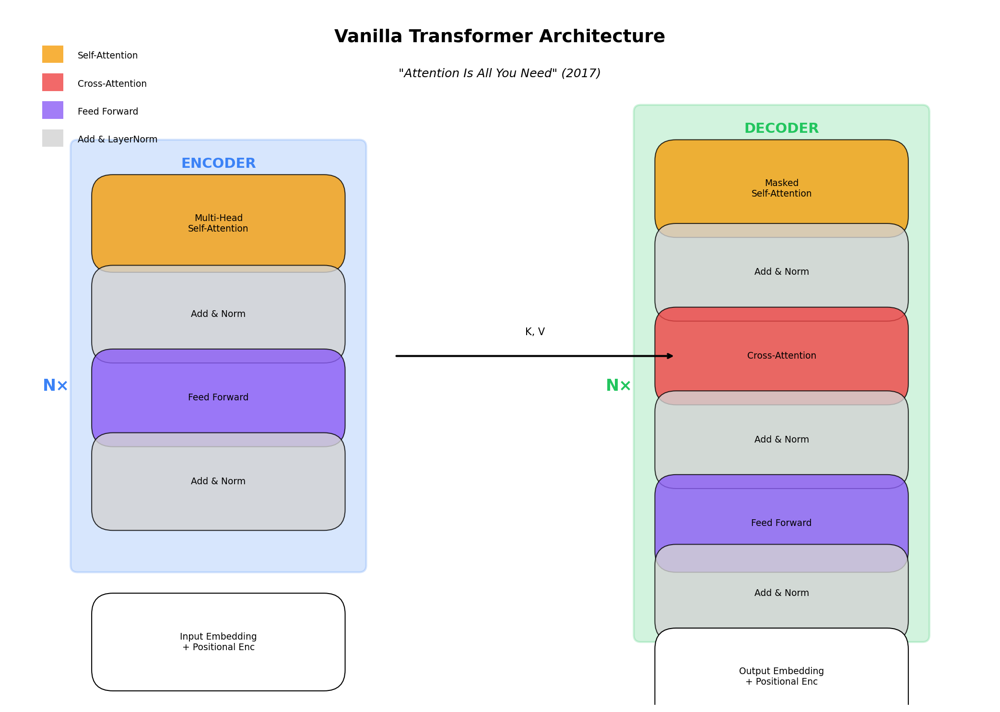

# Vanilla Transformer

[← Back to Architectures](../README.md) | [Next: BERT →](../02_bert/README.md)

[](https://colab.research.google.com/github/gaurav-redhat/transformer_problems/blob/main/transformer_architectures/01_vanilla_transformer/demo.ipynb)

---



## What is it?

The **Vanilla Transformer** is the original architecture from the 2017 paper ["Attention Is All You Need"](https://arxiv.org/abs/1706.03762). It replaced RNNs and LSTMs with pure self-attention, and it's the foundation for BERT, GPT, and every modern LLM.

## Architecture

```
Input → Embedding → [Encoder × N] → [Decoder × N] → Output
```

### Encoder (6 layers in original)
1. **Multi-Head Self-Attention** - Each token attends to all tokens
2. **Add & Norm** - Residual connection + LayerNorm
3. **Feed Forward Network** - Two linear layers with ReLU
4. **Add & Norm**

### Decoder (6 layers in original)
1. **Masked Multi-Head Self-Attention** - Only see past tokens
2. **Add & Norm**
3. **Cross-Attention** - Attend to encoder outputs
4. **Add & Norm**
5. **Feed Forward Network**
6. **Add & Norm**

## The Math

### Scaled Dot-Product Attention

```
Attention(Q, K, V) = softmax(QK^T / √d_k) × V
```

- **Q (Query)**: What am I looking for?
- **K (Key)**: What do I contain?
- **V (Value)**: What do I return?
- **√d_k**: Scaling factor (prevents softmax saturation)

### Multi-Head Attention

Instead of one attention, use `h` heads in parallel:

```
MultiHead(Q, K, V) = Concat(head_1, ..., head_h) × W_O

where head_i = Attention(Q×W_Q^i, K×W_K^i, V×W_V^i)
```

Why multiple heads? Different heads learn different relationships (syntax, semantics, coreference, etc.)

### Position Encoding

Transformers have no notion of order. We add positional information:

```
PE(pos, 2i)   = sin(pos / 10000^(2i/d))
PE(pos, 2i+1) = cos(pos / 10000^(2i/d))
```

## Key Numbers (Original Paper)

| Parameter | Value |
|-----------|-------|
| d_model | 512 |
| d_ff | 2048 |
| h (heads) | 8 |
| d_k = d_v | 64 |
| N (layers) | 6 |
| Parameters | ~65M |

## Complexity

| Operation | Time | Memory |
|-----------|------|--------|
| Self-Attention | O(N² × d) | O(N² + N×d) |
| Feed Forward | O(N × d²) | O(N × d) |
| **Total** | **O(N² × d)** | **O(N²)** |

The N² is the bottleneck - this is why we have Longformer, Performer, etc.

## Code Highlights

```python
# Scaled dot-product attention
def attention(Q, K, V, mask=None):
    d_k = Q.size(-1)
    scores = torch.matmul(Q, K.transpose(-2, -1)) / math.sqrt(d_k)
    if mask is not None:
        scores = scores.masked_fill(mask == 0, -1e9)
    attn = F.softmax(scores, dim=-1)
    return torch.matmul(attn, V)
```

## What It's Used For

- **Machine Translation** (original purpose)
- Foundation for BERT (encoder-only)
- Foundation for GPT (decoder-only)
- Any sequence-to-sequence task

## Key Papers

- [Attention Is All You Need](https://arxiv.org/abs/1706.03762) (2017) - The original
- [The Annotated Transformer](https://nlp.seas.harvard.edu/2018/04/03/attention.html) - Great walkthrough

## Try It

Run the notebook to:
1. Build a transformer from scratch
2. Train on a tiny translation task
3. Visualize attention patterns

[](https://colab.research.google.com/github/gaurav-redhat/transformer_problems/blob/main/transformer_architectures/01_vanilla_transformer/demo.ipynb)

