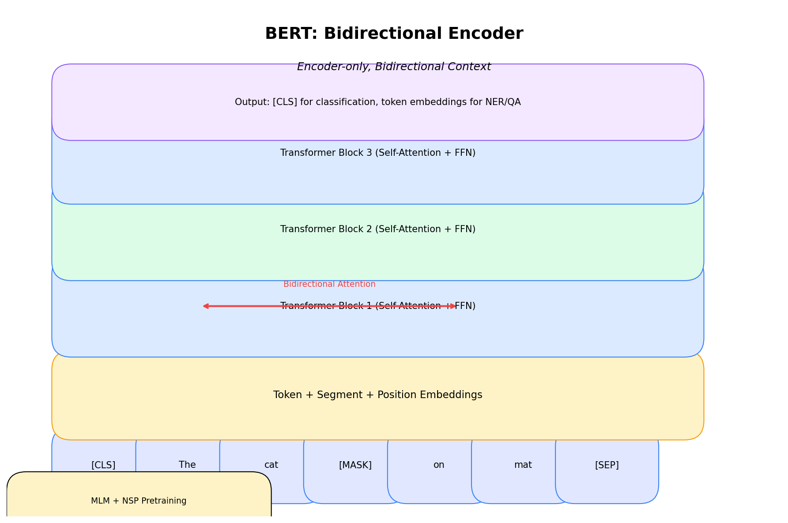

# BERT: Bidirectional Encoder Representations from Transformers

[← Back to Architectures](../README.md) | [← Previous: Vanilla](../01_vanilla_transformer/README.md) | [Next: GPT →](../03_gpt/README.md)

[](https://colab.research.google.com/github/gaurav-redhat/transformer_problems/blob/main/transformer_architectures/02_bert/demo.ipynb)

---



## What is it?

**BERT** (2018) is an **encoder-only** transformer that reads text bidirectionally. Unlike GPT which only sees left context, BERT sees both left AND right context for every token.

This made it revolutionary for understanding tasks (classification, NER, QA) but unsuitable for generation.

## The Key Insight

```
GPT:  "The cat sat on the [MASK]" → only sees "The cat sat on the"
BERT: "The cat sat on the [MASK]" → sees "The cat sat on the" AND "." (both sides!)
```

## Architecture

```
[CLS] Token1 Token2 ... TokenN [SEP]
              ↓
    Token + Segment + Position Embeddings
              ↓
    Transformer Encoder × 12 (or 24)
              ↓
    [CLS] output → Classification
    Token outputs → Token-level tasks
```

### Three Embedding Types
1. **Token Embeddings** - WordPiece vocabulary (30K tokens)
2. **Segment Embeddings** - Sentence A vs Sentence B
3. **Position Embeddings** - Learned (not sinusoidal)

## Pre-training Objectives

### 1. Masked Language Model (MLM)

Randomly mask 15% of tokens, predict them:
- 80% → [MASK]
- 10% → random token
- 10% → unchanged

```
Input:  "The cat [MASK] on the mat"
Output: "The cat sat on the mat"
```

### 2. Next Sentence Prediction (NSP)

Given two sentences, predict if B follows A:

```
[CLS] Sentence A [SEP] Sentence B [SEP]
                  ↓
            IsNext / NotNext
```

(Note: Later work like RoBERTa showed NSP isn't that useful)

## The Math

Same attention as vanilla transformer, but **no causal mask**:

```
Attention(Q, K, V) = softmax(QK^T / √d_k) × V
```

Every token can attend to every other token (bidirectional).

### MLM Loss

```
L_MLM = -∑ log P(x_masked | x_context)
```

## Model Sizes

| Model | Layers | Hidden | Heads | Parameters |
|-------|--------|--------|-------|------------|
| BERT-base | 12 | 768 | 12 | 110M |
| BERT-large | 24 | 1024 | 16 | 340M |

## Code Highlights

```python
# BERT-style masked attention (no causal mask!)
class BertAttention(nn.Module):
    def forward(self, x):
        # Q, K, V from same input (self-attention)
        Q = self.W_q(x)
        K = self.W_k(x)
        V = self.W_v(x)
        
        # No mask - all tokens see all tokens
        attn = softmax(Q @ K.T / sqrt(d_k))
        return attn @ V

# MLM: Predict masked tokens
def mlm_loss(logits, labels, mask):
    # Only compute loss on masked positions
    masked_logits = logits[mask]
    masked_labels = labels[mask]
    return cross_entropy(masked_logits, masked_labels)
```

## What BERT is Good For

✅ **Understanding tasks**:
- Text classification
- Named Entity Recognition (NER)
- Question Answering (extractive)
- Sentiment analysis
- Semantic similarity

❌ **Not good for**:
- Text generation (use GPT)
- Translation (use encoder-decoder)

## BERT Family

| Model | Year | What's Different |
|-------|------|------------------|
| BERT | 2018 | Original |
| RoBERTa | 2019 | More data, no NSP, dynamic masking |
| ALBERT | 2019 | Parameter sharing, smaller |
| DistilBERT | 2019 | Knowledge distillation, 40% smaller |
| DeBERTa | 2020 | Disentangled attention, better |

## Key Papers

- [BERT](https://arxiv.org/abs/1810.04805) (2018) - Original
- [RoBERTa](https://arxiv.org/abs/1907.11692) (2019) - Improved training
- [ALBERT](https://arxiv.org/abs/1909.11942) (2019) - Efficient BERT
- [DeBERTa](https://arxiv.org/abs/2006.03654) (2020) - Current SOTA encoder

## Try It

Run the notebook to:
1. Build BERT from scratch
2. Implement MLM pre-training
3. See bidirectional attention patterns

[](https://colab.research.google.com/github/gaurav-redhat/transformer_problems/blob/main/transformer_architectures/02_bert/demo.ipynb)

