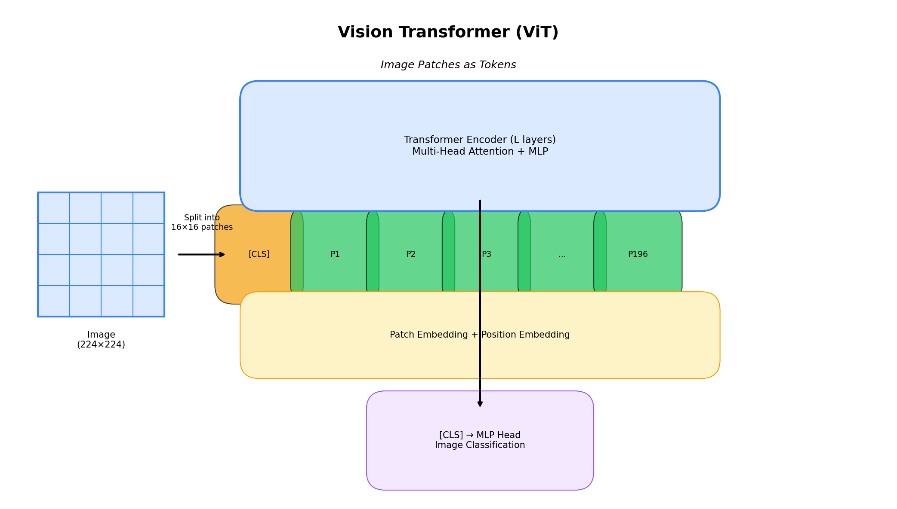

<p align="center">
  
  
  
</p>

<h1 align="center">04. Vision Transformer (ViT)</h1>

<p align="center">
  <a href="../README.md">← Back</a> •
  <a href="../03_gpt/README.md">← Prev</a> •
  <a href="../05_transformer_xl/README.md">Next: Transformer-XL →</a>
</p>

<p align="center">
  <a href="https://colab.research.google.com/github/gaurav-redhat/transformer_problems/blob/main/transformer_architectures/04_vision_transformer/demo.ipynb">
    
  </a>
</p>

---

<p align="center">
  
</p>

---

## 💡 The Idea

For decades, CNNs were the only game in town for images. Then ViT showed up and said: 

> *"What if we just treat image patches as tokens?"*

```
224×224 image → 14×14 = 196 patches (each 16×16)
                     → Feed to transformer
                     → Classify
```

No convolutions. No pooling. Just patches and attention.

---

## 🏗️ Architecture

```
224×224×3 Image
      ↓
Split into 16×16 patches (196 patches)
      ↓
Flatten + Linear → Patch Embeddings
      ↓
[CLS] + Patches + Position Embeddings
      ↓
Transformer Encoder × L
      ↓
[CLS] → MLP Head → Class
```

---

## 🧩 Patch Embedding

| Input | Transformation | Output |
|:-----:|:--------------:|:------:|
| 224×224×3 | 16×16 patches | 196 patches |
| 16×16×3 = 768 | Linear projection | 768-dim tokens |

```python
# Conv2d with kernel=stride=16 does patch embedding
patch_embed = nn.Conv2d(3, 768, kernel_size=16, stride=16)
# (B, 3, 224, 224) → (B, 768, 14, 14) → (B, 196, 768)
```

---

## 📊 Model Sizes

| Model | Layers | Hidden | Heads | Params | ImageNet |
|-------|:------:|:------:|:-----:|:------:|:--------:|
| ViT-B/16 | 12 | 768 | 12 | 86M | 77.9% |
| ViT-L/16 | 24 | 1024 | 16 | 307M | 79.7% |
| ViT-H/14 | 32 | 1280 | 16 | 632M | 81.1% |

> `/16` = patch size 16, `/14` = patch size 14 (more patches, better but slower)

---

## 🆚 ViT vs CNN

| Aspect | ViT | CNN |
|--------|:---:|:---:|
| **Inductive bias** | Minimal | Strong (locality) |
| **Data efficiency** | Needs lots | Works with less |
| **Global context** | From layer 1 | Only deep layers |
| **Scalability** | Excellent | Good |

> 💡 *ViT needs ~100× more data than CNN to match. But at scale, it wins.*

---

## 👨‍👩‍👧‍👦 The ViT Family

| Model | Year | Key Innovation |
|-------|:----:|----------------|
| **ViT** | 2020 | Original |
| **DeiT** | 2021 | Train without JFT, distillation |
| **Swin** | 2021 | Hierarchical, shifted windows ⭐ |
| **BEiT** | 2021 | BERT-style pretraining |
| **MAE** | 2022 | Mask 75% of patches |

---

## 💻 Code

```python
class ViT(nn.Module):
    def __init__(self, img_size=224, patch_size=16, embed_dim=768, n_classes=1000):
        self.patch_embed = nn.Conv2d(3, embed_dim, patch_size, patch_size)
        self.cls_token = nn.Parameter(torch.zeros(1, 1, embed_dim))
        self.pos_embed = nn.Parameter(torch.zeros(1, 197, embed_dim))
        self.transformer = TransformerEncoder(...)
        self.head = nn.Linear(embed_dim, n_classes)
    
    def forward(self, x):
        x = self.patch_embed(x).flatten(2).transpose(1, 2)  # (B, 196, 768)
        cls = self.cls_token.expand(x.size(0), -1, -1)
        x = torch.cat([cls, x], dim=1) + self.pos_embed
        x = self.transformer(x)
        return self.head(x[:, 0])  # [CLS] token
```

---

## 📚 Papers

| Paper | Year |
|-------|:----:|
| [ViT](https://arxiv.org/abs/2010.11929) | 2020 |
| [DeiT](https://arxiv.org/abs/2012.12877) | 2021 |
| [Swin Transformer](https://arxiv.org/abs/2103.14030) | 2021 |
| [MAE](https://arxiv.org/abs/2111.06377) | 2022 |

---

<p align="center">
  <a href="https://colab.research.google.com/github/gaurav-redhat/transformer_problems/blob/main/transformer_architectures/04_vision_transformer/demo.ipynb">
    
  </a>
</p>

<p align="center">
  <sub>Build ViT from scratch • Train on CIFAR-10 • Visualize attention maps</sub>
</p>
