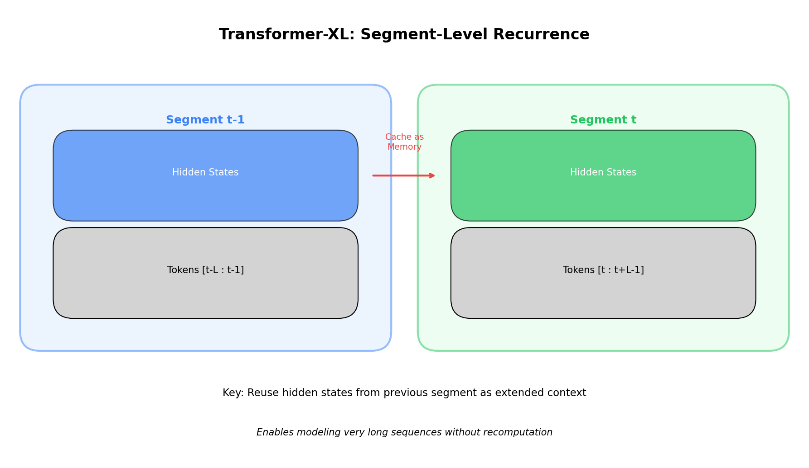

<p align="center">
  
  
  
</p>

<h1 align="center">05. Transformer-XL</h1>

<p align="center">
  <a href="../README.md">← Back</a> •
  <a href="../04_vision_transformer/README.md">← Prev</a> •
  <a href="../06_sparse_transformer/README.md">Next: Sparse →</a>
</p>

<p align="center">
  <a href="https://colab.research.google.com/github/gaurav-redhat/transformer_problems/blob/main/transformer_architectures/05_transformer_xl/demo.ipynb">
    
  </a>
</p>

---

<p align="center">
  
</p>

---

## 💡 The Idea

Standard transformers have a hard context limit. Whatever fits in the window is all the model sees.

> *Transformer-XL caches hidden states between segments — information flows across boundaries.*

---

## ❌ The Problem

```
Standard Transformer:
Segment 1: [tokens 1-512]   → process → FORGET
Segment 2: [tokens 513-1024] → process → no idea what happened before
```

This is **context fragmentation** — can't learn dependencies across segments.

---

## ✅ The Solution

```
Transformer-XL:
Segment 1: [tokens 1-512]   → process → CACHE hidden states
Segment 2: [tokens 513-1024] → process WITH access to cached states
```

Token 513 can now attend to token 512!

---

## 🏗️ How It Works

```
Segment t-1                    Segment t (current)
    ↓                              ↓
[Hidden states]  ────CACHE────>  [Attention]
    ↓                              ↓
(stop gradient)           Attend to memory + current
```

1. Cache hidden states from previous segment
2. Concatenate cache with current states
3. Query from current, Key/Value from concatenated
4. Save current states for next segment

---

## 📐 Relative Position

Absolute positions don't work across segments (pos 0 in seg 2 ≠ pos 0 in seg 1).

> *Solution: encode **relative** positions — "how far apart are two tokens?"*

```
A_ij = q_i·k_j + q_i·R_{i-j} + u·k_j + v·R_{i-j}
       ├─────┘   ├─────────┘   ├───┘   ├───────┘
       content   position      global  global pos
```

---

## 📊 Effective Context

| Layers | Memory | Effective Context |
|:------:|:------:|:-----------------:|
| 1 | L | 2L |
| 4 | L | 5L |
| 6 | L | 7L |

With 4 layers and 512 segment length → ~2500 tokens!

---

## ⚡ Inference Speedup

| Method | What Happens |
|--------|--------------|
| **Standard** | Recompute entire context for each token |
| **Transformer-XL** | Reuse cached states |

> 📈 **~1800× speedup** at evaluation (not a typo!)

---

## 💻 Code

```python
class TransformerXLAttention(nn.Module):
    def forward(self, h, memory=None):
        if memory is not None:
            cat = torch.cat([memory, h], dim=1)  # Extended context
        else:
            cat = h
        
        Q = self.W_q(h)       # Query from current only
        K = self.W_k(cat)     # Key from memory + current
        V = self.W_v(cat)     # Value from memory + current
        
        return attention(Q, K, V)

class TransformerXL(nn.Module):
    def forward(self, x, memories=None):
        new_memories = []
        for layer, mem in zip(self.layers, memories or [None]*self.n_layers):
            new_memories.append(x.detach())  # Cache for next segment
            x = layer(x, memory=mem)
        return x, new_memories
```

---

## 📚 Papers

| Paper | Year |
|-------|:----:|
| [Transformer-XL](https://arxiv.org/abs/1901.02860) | 2019 |
| [Compressive Transformer](https://arxiv.org/abs/1911.05507) | 2019 |

---

<p align="center">
  <a href="https://colab.research.google.com/github/gaurav-redhat/transformer_problems/blob/main/transformer_architectures/05_transformer_xl/demo.ipynb">
    
  </a>
</p>

<p align="center">
  <sub>Build with memory • Compare context length • See the speedup</sub>
</p>
