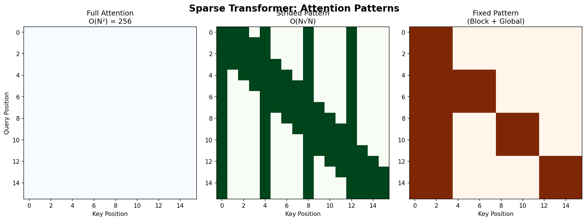

<p align="center">
  
  
  
</p>

<h1 align="center">06. Sparse Transformer</h1>

<p align="center">
  <a href="../README.md">← Back</a> •
  <a href="../05_transformer_xl/README.md">← Prev</a> •
  <a href="../07_performer/README.md">Next: Performer →</a>
</p>

<p align="center">
  <a href="https://colab.research.google.com/github/gaurav-redhat/transformer_problems/blob/main/transformer_architectures/06_sparse_transformer/demo.ipynb">
    
  </a>
</p>

---

<p align="center">
  
</p>

---

## 💡 The Idea

The O(N²) problem gets bad fast. Do we really need every token to attend to every other token?

> *What if we only compute attention for pairs that matter?*

---

## 📈 The Scale Problem

| Sequence | Dense O(N²) | Sparse O(N√N) | Speedup |
|:--------:|:-----------:|:-------------:|:-------:|
| 1K | 1M | 32K | **32×** |
| 4K | 16M | 256K | **64×** |
| 16K | 256M | 2M | **128×** |

---

## 🎯 The Patterns

<table>
<tr>
<td align="center" width="33%">

### 🔲 Local
Attend to nearby tokens

```
Token 5 → [3,4,5,6,7]
```

*Good for: syntax, local context*

</td>
<td align="center" width="33%">

### 📏 Strided
Attend to every k-th token

```
Token 8 → [0, 4, 8]
```

*Good for: long-range*

</td>
<td align="center" width="33%">

### 🔄 Combined
Alternate patterns by layer

```
L1: Local
L2: Strided
L3: Local
...
```

*Best of both*

</td>
</tr>
</table>

---

## 👁️ Visualizing Patterns

```
Dense:              Local:              Strided:            Combined:
■ ■ ■ ■ ■ ■ ■ ■     ■ ■ □ □ □ □ □ □     ■ □ □ □ ■ □ □ □     ■ ■ □ □ ■ □ □ □
■ ■ ■ ■ ■ ■ ■ ■     ■ ■ ■ □ □ □ □ □     □ ■ □ □ □ ■ □ □     ■ ■ ■ □ □ ■ □ □
■ ■ ■ ■ ■ ■ ■ ■     □ ■ ■ ■ □ □ □ □     □ □ ■ □ □ □ ■ □     □ ■ ■ ■ □ □ ■ □
■ ■ ■ ■ ■ ■ ■ ■     □ □ ■ ■ ■ □ □ □     □ □ □ ■ □ □ □ ■     □ □ ■ ■ ■ □ □ ■
...                 ...                 ...                 ...
```

---

## ➗ The Math

### Dense Attention
```
A_ij = 1 for all i, j → O(N²)
```

### Sparse Attention
```
A_ij = 1 only if j ∈ S(i), |S(i)| = O(√N) → O(N√N)
```

---

## 💻 Code

```python
def sparse_mask(seq_len, window_size, stride):
    mask = torch.zeros(seq_len, seq_len)
    
    for i in range(seq_len):
        # Local: nearby tokens
        start = max(0, i - window_size // 2)
        end = min(seq_len, i + window_size // 2 + 1)
        mask[i, start:end] = 1
        
        # Strided: every stride-th token
        for j in range(0, i + 1, stride):
            mask[i, j] = 1
    
    return mask

def sparse_attention(Q, K, V, mask):
    scores = Q @ K.T / sqrt(d_k)
    scores = scores.masked_fill(mask == 0, float('-inf'))
    return softmax(scores) @ V
```

---

## 🎯 Use Cases

| Application | Why Sparse Helps |
|-------------|------------------|
| **GPT-3** | Some layers use sparse attention |
| **Image generation** | 64×64 = 4096 tokens |
| **Audio** | Raw audio = very long sequences |

---

## ⚠️ The Tradeoff

> *Sparse attention is an approximation — you're betting skipped tokens don't matter.*

Modern approach: **FlashAttention** — exact attention but fast. Sparse was more important before FlashAttention existed.

---

## 📚 Papers

| Paper | Year |
|-------|:----:|
| [Sparse Transformers](https://arxiv.org/abs/1904.10509) | 2019 |
| [ImageGPT](https://cdn.openai.com/papers/Generative_Pretraining_from_Pixels_V2.pdf) | 2020 |

---

<p align="center">
  <a href="https://colab.research.google.com/github/gaurav-redhat/transformer_problems/blob/main/transformer_architectures/06_sparse_transformer/demo.ipynb">
    
  </a>
</p>

<p align="center">
  <sub>Build sparse patterns • Visualize masks • Measure speedup</sub>
</p>
