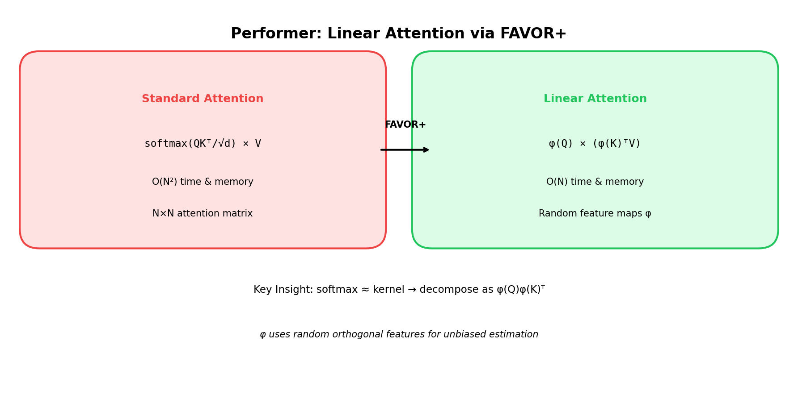

# Performer: Fast Attention via FAVOR+

[← Back to Architectures](../README.md) | [← Previous: Sparse Transformer](../06_sparse_transformer/README.md) | [Next: Reformer →](../08_reformer/README.md)

[](https://colab.research.google.com/github/gaurav-redhat/transformer_problems/blob/main/transformer_architectures/07_performer/demo.ipynb)

---



## What is it?

**Performer** (Google, 2020) achieves **true linear O(N) attention** by approximating the softmax kernel using random features. Unlike sparse methods that skip computations, Performer computes an approximation of full attention with provable guarantees.

## The Problem

Standard attention computes:
```
Attention = softmax(QK^T / √d) × V
```

We must compute QK^T first → O(N²) matrix.

## The Key Insight: Kernel Trick

Softmax can be viewed as a **kernel function**:
```
softmax(q^T k / √d) ≈ K(q, k) = exp(q^T k)
```

If we can decompose the kernel: K(x, y) = φ(x)^T φ(y)

Then attention becomes:
```
Attention ≈ φ(Q) × (φ(K)^T × V)
```

**Compute (K^T V) first** → O(N × d²) instead of O(N² × d)!

## FAVOR+: Fast Attention Via Positive Orthogonal Random Features

### Random Feature Map

```
φ(x) = (1/√m) × [f(w₁^T x), f(w₂^T x), ..., f(wₘ^T x)]
```

Where:
- w_i are random orthogonal projections
- f is a nonlinearity that ensures positive features
- m is the number of random features

### For Softmax Kernel

```
φ(x) = (1/√m) × exp(-||x||²/2) × [exp(w₁^T x), ..., exp(wₘ^T x)]
```

This gives an **unbiased estimator** of softmax attention!

## The Math

### Standard Attention
```
Attn(Q, K, V) = softmax(QK^T / √d) × V     [O(N² d)]
             = D^(-1) × exp(QK^T / √d) × V
```

### FAVOR+ Attention
```
Attn(Q, K, V) ≈ φ(Q) × (φ(K)^T V) / (φ(Q) × φ(K)^T 1)    [O(N d²)]
```

Key steps:
1. Compute φ(Q): N × m matrix
2. Compute φ(K)^T V: m × d matrix (this is the trick!)
3. Multiply: N × d output

## Complexity Comparison

| Operation | Standard | FAVOR+ |
|-----------|----------|--------|
| QK^T | O(N² d) | - |
| φ(K)^T V | - | O(N d m) |
| φ(Q)(φ(K)^T V) | - | O(N d m) |
| **Total** | **O(N² d)** | **O(N d m)** |

When N >> d and m ≈ d: **N²d → Nd²** → huge savings!

### Example

```
N = 16384, d = 64, m = 64
Standard:  16384² × 64 = 17B operations
FAVOR+:    16384 × 64² = 67M operations
Speedup:   ~256x
```

## Code Highlights

```python
def random_feature_map(x, omega, eps=1e-6):
    """FAVOR+ random feature map."""
    # x: (B, N, d)
    # omega: (d, m) random projections
    
    # Project
    projection = x @ omega  # (B, N, m)
    
    # Normalize (for numerical stability)
    norm_sq = (x ** 2).sum(dim=-1, keepdim=True) / 2
    
    # Positive random features
    features = torch.exp(projection - norm_sq) / math.sqrt(omega.size(1))
    
    return features

def favor_attention(Q, K, V, omega):
    """Linear attention via FAVOR+."""
    # Apply feature map
    Q_prime = random_feature_map(Q, omega)  # (B, N, m)
    K_prime = random_feature_map(K, omega)  # (B, N, m)
    
    # THE KEY: Compute K'V first (m × d), then multiply by Q'
    KV = K_prime.transpose(-2, -1) @ V      # (B, m, d)
    K_sum = K_prime.sum(dim=1, keepdim=True).transpose(-2, -1)  # (B, m, 1)
    
    # Output
    numerator = Q_prime @ KV                # (B, N, d)
    denominator = Q_prime @ K_sum           # (B, N, 1)
    
    return numerator / (denominator + 1e-6)
```

## Causal (Autoregressive) FAVOR+

For causal attention (GPT-style), use **prefix sums**:

```python
def causal_favor_attention(Q_prime, K_prime, V):
    """Causal linear attention using cumulative sums."""
    outputs = []
    KV_cumsum = torch.zeros(B, m, d)
    K_cumsum = torch.zeros(B, m, 1)
    
    for t in range(N):
        k_t = K_prime[:, t:t+1, :]
        v_t = V[:, t:t+1, :]
        q_t = Q_prime[:, t:t+1, :]
        
        KV_cumsum += k_t.transpose(-2, -1) @ v_t
        K_cumsum += k_t.transpose(-2, -1)
        
        out_t = q_t @ KV_cumsum / (q_t @ K_cumsum + eps)
        outputs.append(out_t)
    
    return torch.cat(outputs, dim=1)
```

## Approximation Quality

The approximation error depends on:
- Number of random features (m)
- Sequence length (N)

Rule of thumb: m ≈ d gives good approximation.

## Performer vs Other Methods

| Method | Complexity | Exact? | Bidirectional? | Causal? |
|--------|------------|--------|----------------|---------|
| Standard | O(N²) | Yes | Yes | Yes |
| Sparse | O(N√N) | No (misses some) | Yes | Yes |
| Performer | O(N) | No (approximation) | Yes | Yes |
| Linear Attention | O(N) | No | Yes | Tricky |

## Key Papers

- [Performer](https://arxiv.org/abs/2009.14794) (2020) - Original
- [Random Features for Kernels](https://papers.nips.cc/paper/2007/hash/013a006f03dbc5392effeb8f18fda755-Abstract.html) - Theory background

## Try It

Run the notebook to:
1. Implement FAVOR+ from scratch
2. Compare approximation quality vs exact attention
3. Measure speedup on long sequences
4. See how m affects quality

[](https://colab.research.google.com/github/gaurav-redhat/transformer_problems/blob/main/transformer_architectures/07_performer/demo.ipynb)

