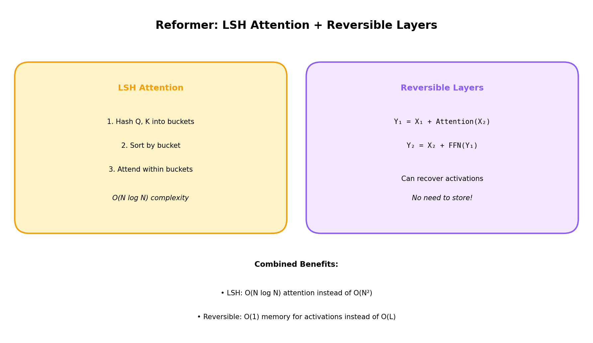

# Reformer: Efficient Transformers

[← Back to Architectures](../README.md) | [← Previous: Performer](../07_performer/README.md) | [Next: Longformer →](../09_longformer/README.md)

[](https://colab.research.google.com/github/gaurav-redhat/transformer_problems/blob/main/transformer_architectures/08_reformer/demo.ipynb)

---



## What is it?

**Reformer** (Google, 2020) tackles both the **attention complexity** (O(N²)) and **memory** problems of transformers using two techniques:

1. **LSH Attention**: O(N log N) attention via locality-sensitive hashing
2. **Reversible Layers**: No need to store activations for backprop

Together, these allow processing sequences up to 64K tokens on a single GPU.

## The Problems

### Problem 1: O(N²) Attention
Standard attention computes all-pairs similarity → quadratic.

### Problem 2: Memory for Backprop
During training, we store activations at each layer for backpropagation:
```
Memory = O(N × L × d)  where L = number of layers
```

For 64K tokens and 12 layers → gigabytes of activation storage!

## Solution 1: LSH Attention

### The Idea

Similar queries should have similar keys. So:
1. **Hash** queries and keys into buckets
2. Only compute attention **within buckets**
3. Similar vectors → same bucket (with high probability)

### Locality Sensitive Hashing (LSH)

LSH: Hash function where similar items collide:
```
P(h(x) = h(y)) ∝ similarity(x, y)
```

For angular similarity (used in attention):
```
h(x) = sign(x · r)  where r is a random vector
```

### LSH Attention Algorithm

```
1. Compute queries Q and keys K
2. Hash Q and K into buckets using LSH
3. Sort by bucket
4. For each bucket: compute attention only within bucket
5. (Optional) Multiple rounds for better coverage
```

### Complexity

| Method | Attention Complexity |
|--------|---------------------|
| Standard | O(N²) |
| LSH | O(N × bucket_size) ≈ O(N log N) |

With N/bucket rounds and bucket_size ≈ N/buckets:
```
Total ≈ O(N × (N/buckets) × rounds) = O(N log N) when buckets ∝ √N
```

## Solution 2: Reversible Layers

### The Problem

Standard backprop: Store activations for every layer
```
Forward:  x₀ → x₁ → x₂ → ... → xₗ  (store all)
Backward: Need x₀, x₁, ... for gradients
```

### Reversible Residual Network

Split activations into two streams (x₁, x₂):
```
Forward:
y₁ = x₁ + F(x₂)
y₂ = x₂ + G(y₁)

Backward (reconstruct inputs from outputs):
x₂ = y₂ - G(y₁)
x₁ = y₁ - F(x₂)
```

**No need to store intermediate activations!**

### Memory Savings

| Method | Activation Memory |
|--------|-------------------|
| Standard | O(N × L × d) |
| Reversible | O(N × d) |

Save factor of L (number of layers)!

## The Math

### LSH Attention

Standard attention:
```
Attention(Q, K, V) = softmax(QK^T / √d) × V
```

LSH attention:
```
For each query qᵢ:
  1. Find bucket b = LSH(qᵢ)
  2. Get keys in same bucket: K_b = {kⱼ : LSH(kⱼ) = b}
  3. Attend only to K_b

Attention(qᵢ) = softmax(qᵢ K_b^T / √d) × V_b
```

### Reversible Layer

```
Given: F = Attention, G = FFN

Forward:
y₁ = x₁ + Attention(x₂)
y₂ = x₂ + FFN(y₁)

Backward:
x₂ = y₂ - FFN(y₁)      # Reconstruct x₂
x₁ = y₁ - Attention(x₂) # Reconstruct x₁
```

## Code Highlights

```python
def lsh_hash(x, n_hashes, n_buckets):
    """Angular LSH: similar directions -> same bucket."""
    d = x.shape[-1]
    
    # Random projection vectors
    projections = torch.randn(n_hashes, d, n_buckets // 2)
    
    # Project and get sign
    dots = torch.einsum('...d,hdb->...hb', x, projections)
    buckets = (dots > 0).int()
    
    # Combine hash values
    powers = 2 ** torch.arange(n_buckets // 2)
    bucket_ids = (buckets * powers).sum(dim=-1)
    
    return bucket_ids

class ReversibleBlock(nn.Module):
    def __init__(self, f, g):
        self.f = f  # Attention
        self.g = g  # FFN
    
    def forward(self, x1, x2):
        y1 = x1 + self.f(x2)
        y2 = x2 + self.g(y1)
        return y1, y2
    
    def backward_pass(self, y1, y2):
        """Reconstruct inputs from outputs."""
        x2 = y2 - self.g(y1)
        x1 = y1 - self.f(x2)
        return x1, x2
```

## Chunked Feed-Forward

Additional memory saving: Process FFN in chunks:

```python
def chunked_ffn(x, ffn, chunk_size=128):
    outputs = []
    for i in range(0, x.size(1), chunk_size):
        chunk = x[:, i:i+chunk_size]
        outputs.append(ffn(chunk))
    return torch.cat(outputs, dim=1)
```

## Reformer Summary

| Technique | Saves | How |
|-----------|-------|-----|
| LSH Attention | Compute | Only attend within buckets |
| Reversible Layers | Memory | Recompute activations on backward |
| Chunked FFN | Memory | Process in chunks |
| Shared Q/K | Parameters | Use Q = K for LSH |

## Limitations

1. **LSH has variance**: May miss some important keys
2. **Multiple rounds needed**: For better coverage
3. **Reversible adds compute**: Recompute during backward
4. **Harder to implement**: Complex hashing logic

## Key Papers

- [Reformer](https://arxiv.org/abs/2001.04451) (2020) - Original
- [RevNets](https://arxiv.org/abs/1707.04585) (2017) - Reversible networks

## Try It

Run the notebook to:
1. Implement LSH attention
2. Build reversible layers
3. Compare memory usage
4. See LSH bucket assignments

[](https://colab.research.google.com/github/gaurav-redhat/transformer_problems/blob/main/transformer_architectures/08_reformer/demo.ipynb)

