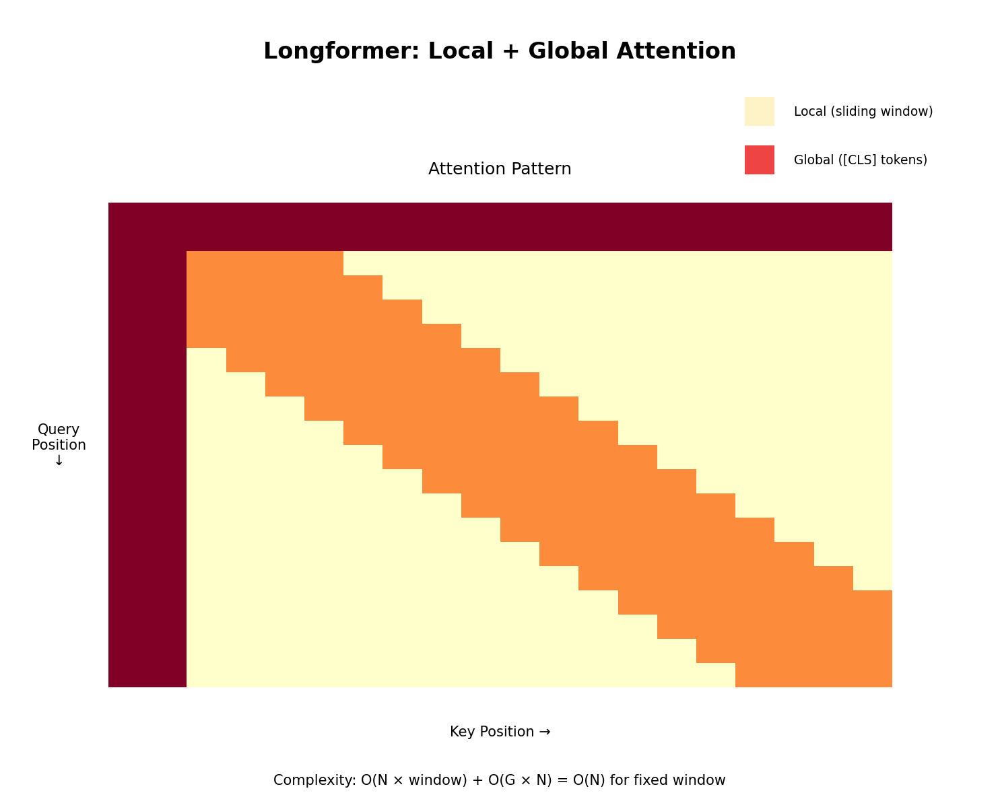

# Longformer: Long Document Transformer

[← Back to Architectures](../README.md) | [← Previous: Reformer](../08_reformer/README.md) | [Next: Switch Transformer →](../10_switch_transformer/README.md)

[](https://colab.research.google.com/github/gaurav-redhat/transformer_problems/blob/main/transformer_architectures/09_longformer/demo.ipynb)

---



## What is it?

**Longformer** (AllenAI, 2020) is designed for **long documents** (4K-16K tokens). It combines:

1. **Sliding Window Attention**: Local context efficiently
2. **Global Attention**: Selected tokens see everything

This is simpler than LSH (Reformer) or random features (Performer), yet works great in practice.

## The Insight

For most NLP tasks:
- **Local context matters most** (nearby words)
- **A few positions need global view** ([CLS] for classification, question for QA)

So: Use local attention everywhere + global attention for special tokens.

## Architecture

### Sliding Window Attention (Local)

Each token attends to a window of size w around it:

```
Token i attends to: [i-w/2, i-w/2+1, ..., i, ..., i+w/2-1, i+w/2]
```

Complexity: O(N × w) instead of O(N²)

```
Example with w=4:
Position 5 attends to: [3, 4, 5, 6, 7]
```

### Dilated Sliding Window

For even larger receptive field, use dilation:

```
Dilation d=2, window w=4:
Position 8 attends to: [0, 2, 4, 6, 8, 10, 12, 14]
```

### Global Attention

Certain tokens (e.g., [CLS], question tokens) have **full attention**:
- They attend to ALL tokens
- ALL tokens attend to them

```
Global tokens: [CLS] at position 0
- [CLS] sees: [0, 1, 2, ..., N-1]  (all)
- All positions see: [..., 0, ...]  ([CLS])
```

## The Math

### Attention Pattern

```
A_ij = 1 if:
  - |i - j| ≤ w/2  (local window)
  - OR i is global token
  - OR j is global token

A_ij = 0 otherwise
```

### Complexity

| Component | Complexity |
|-----------|------------|
| Local attention | O(N × w) |
| Global attention | O(N × g) |
| **Total** | **O(N × (w + g))** |

Where g = number of global tokens (usually small, like 1-10).

### Comparison

| Method | Complexity | Memory |
|--------|------------|--------|
| BERT | O(N²) | O(N²) |
| Longformer | O(N × w) | O(N × w) |

For N=4096, w=512: 4096² vs 4096×512 = **8x speedup**

## Code Highlights

```python
def sliding_window_mask(seq_len, window_size):
    """Create sliding window attention mask."""
    mask = torch.zeros(seq_len, seq_len)
    half_w = window_size // 2
    
    for i in range(seq_len):
        start = max(0, i - half_w)
        end = min(seq_len, i + half_w + 1)
        mask[i, start:end] = 1
    
    return mask

def add_global_attention(mask, global_indices):
    """Add global attention for specified positions."""
    for idx in global_indices:
        mask[idx, :] = 1  # Global token attends to all
        mask[:, idx] = 1  # All attend to global token
    return mask

class LongformerAttention(nn.Module):
    def __init__(self, d_model, n_heads, window_size):
        super().__init__()
        self.window_size = window_size
        # ... projection layers ...
    
    def forward(self, x, global_mask=None):
        B, N, C = x.shape
        
        # Create local mask
        local_mask = sliding_window_mask(N, self.window_size)
        
        # Add global positions
        if global_mask is not None:
            local_mask = add_global_attention(local_mask, global_mask)
        
        # Compute attention with mask
        attn = (Q @ K.T) / sqrt(d_k)
        attn = attn.masked_fill(local_mask == 0, -inf)
        attn = softmax(attn)
        
        return attn @ V
```

## Task-Specific Global Attention

| Task | Global Tokens |
|------|---------------|
| Classification | [CLS] |
| Question Answering | All question tokens |
| Summarization | [CLS] + paragraph starts |
| NER | None (all local) |

## Longformer vs BERT

| Model | Max Length | Memory (4K tokens) |
|-------|------------|-------------------|
| BERT-base | 512 | OOM |
| Longformer-base | 4096 | ~3GB |
| Longformer-large | 4096 | ~8GB |

## Practical Considerations

### Window Size
- Smaller window (256): Faster, less context
- Larger window (512): Slower, more context
- Default: 512

### Number of Global Tokens
- More globals: Better long-range reasoning
- Fewer globals: Faster
- Task-dependent

### Gradient Checkpointing
Still use gradient checkpointing for very long sequences (16K+).

## Model Sizes

| Model | Layers | Hidden | Window | Max Length |
|-------|--------|--------|--------|------------|
| Longformer-base | 12 | 768 | 512 | 4096 |
| Longformer-large | 24 | 1024 | 512 | 4096 |

## Longformer Family

| Model | Year | Key Feature |
|-------|------|-------------|
| Longformer | 2020 | Original |
| LED | 2020 | Longformer Encoder-Decoder (for summarization) |
| BigBird | 2020 | Similar idea + random attention |

## Key Papers

- [Longformer](https://arxiv.org/abs/2004.05150) (2020) - Original
- [BigBird](https://arxiv.org/abs/2007.14062) (2020) - Google's version

## When to Use Longformer

✅ **Good for:**
- Long document classification
- Long-form QA
- Summarization
- Legal/medical documents

❌ **Not needed for:**
- Short sequences (< 512)
- When you need exact full attention
- Tasks where all tokens need global context

## Try It

Run the notebook to:
1. Implement sliding window attention
2. Add global attention
3. Compare vs full attention
4. Train on a long document task

[](https://colab.research.google.com/github/gaurav-redhat/transformer_problems/blob/main/transformer_architectures/09_longformer/demo.ipynb)

