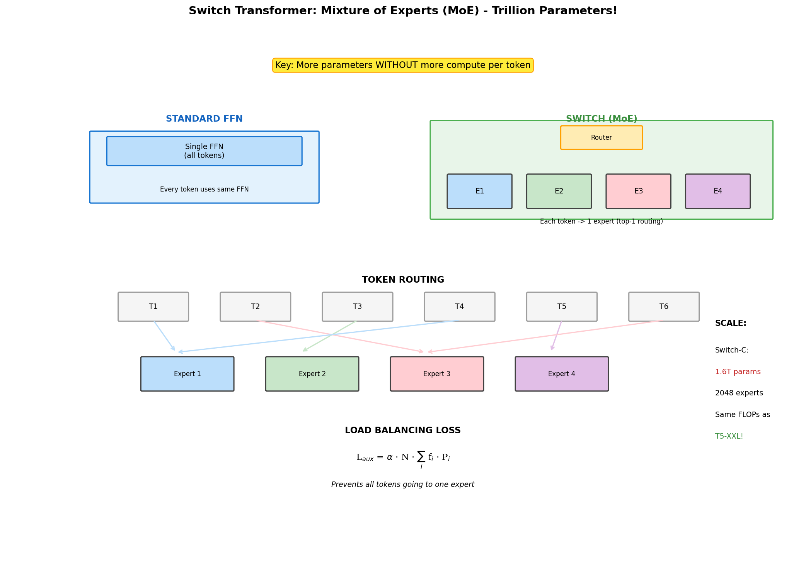

# Switch Transformer

[← Back](../README.md) | [← Prev: Longformer](../09_longformer/README.md)

[](https://colab.research.google.com/github/gaurav-redhat/transformer_problems/blob/main/transformer_architectures/10_switch_transformer/demo.ipynb)

---



Here's a wild idea: what if you could have a trillion parameters but only use a fraction of them for each input? Switch Transformer does exactly this using **Mixture of Experts** (MoE). Each token gets routed to one of many "expert" networks. More capacity, same compute.

---

## The problem with scaling

Traditional scaling: more parameters = more FLOPs = more time/money.

GPT-3 (175B params) took ~300K GPU hours. Want 10× more parameters? Pay 10× more compute.

Switch Transformer breaks this relationship.

---

## The key idea

Instead of one big feed-forward network, use N smaller "experts":

```
Standard:  Token → [Single Large FFN] → Output

Switch:    Token → [Router] → Expert 3 → Output
                            ↗
           Token → [Router] → Expert 7 → Output
```

Each token goes to exactly **one** expert (top-1 routing). You have N× more parameters, but each token only activates 1/N of them. Same FLOPs per token.

---

## How routing works

A learned linear layer decides which expert each token goes to:

```python
router_logits = W_router @ token    # (d,) → (n_experts,)
expert_weights = softmax(router_logits)
chosen_expert = argmax(expert_weights)
```

Simple. Token goes in, expert index comes out.

---

## The scale

| Model | Total Params | Active Params | Experts |
|-------|--------------|---------------|---------|
| Switch-Base | 7B | 335M | 128 |
| Switch-Large | 26B | 783M | 128 |
| Switch-C | 1.6T | 12.8B | 2048 |

**1.6 trillion parameters**. But each token only uses 12.8B. Same cost as a 12.8B dense model, with the capacity of a 1.6T model.

---

## The catch: load balancing

If every token goes to the same expert, you've wasted N-1 experts and created a bottleneck. The model wants to collapse to using one expert.

Fix: auxiliary loss that encourages balanced routing:

```
L_aux = α × N × Σᵢ (fraction_routed_to_i × avg_prob_for_i)
```

This pushes toward uniform distribution across experts.

---

## Capacity

Experts have limited capacity per batch. If too many tokens route to one expert, some get dropped:

```
capacity = (batch_size × seq_len / n_experts) × capacity_factor
```

With capacity_factor=1.25, you have 25% buffer. Overflow tokens skip the expert (use identity shortcut).

---

## Code

The router:

```python
class SwitchRouter(nn.Module):
    def __init__(self, d_model, n_experts):
        self.router = nn.Linear(d_model, n_experts)
    
    def forward(self, x):
        logits = self.router(x)
        probs = F.softmax(logits, dim=-1)
        expert_idx = probs.argmax(dim=-1)
        expert_weight = probs.max(dim=-1).values
        return expert_idx, expert_weight
```

The switch layer:

```python
class SwitchFFN(nn.Module):
    def __init__(self, d_model, d_ff, n_experts):
        self.router = SwitchRouter(d_model, n_experts)
        self.experts = nn.ModuleList([
            FFN(d_model, d_ff) for _ in range(n_experts)
        ])
    
    def forward(self, x):
        expert_idx, expert_weight = self.router(x)
        output = torch.zeros_like(x)
        
        for i, expert in enumerate(self.experts):
            mask = (expert_idx == i)
            if mask.any():
                output[mask] = expert_weight[mask, None] * expert(x[mask])
        
        return output
```

---

## Top-1 vs Top-K

| Method | Experts/token | Compute | Capacity |
|--------|---------------|---------|----------|
| Top-1 (Switch) | 1 | Lowest | Lower |
| Top-2 | 2 | 2× | Higher |
| Soft MoE | All | N× | Highest |

Switch chose top-1 for maximum efficiency. Later models like Mixtral use top-2 for better quality.

---

## The MoE family

| Model | Year | Routing | Scale |
|-------|------|---------|-------|
| Switch | 2021 | Top-1 | 1.6T |
| GLaM | 2021 | Top-2 | 1.2T |
| Mixtral | 2023 | Top-2 | 46B (12B active) |
| DeepSeek-V3 | 2024 | Fine-grained | 671B (37B active) |

MoE is now standard for frontier models. It's how you get to massive scale affordably.

---

## Training tips

1. **Use bfloat16** - MoE is numerically sensitive
2. **Keep router in float32** - Precision matters for routing decisions
3. **Start with fewer experts** - 8 or 16 before scaling to hundreds
4. **Monitor expert utilization** - Watch for collapse

---

## Why it matters

MoE changes the game. You can have models with enormous capacity (memory of facts, knowledge) without proportional inference cost. This is likely how GPT-4 works (rumored to be MoE).

The tradeoff: communication overhead between experts, more complex training, memory for all expert weights.

---

## Papers

- [Switch Transformer](https://arxiv.org/abs/2101.03961) (2021) - Original
- [GLaM](https://arxiv.org/abs/2112.06905) (2021) - Google's MoE
- [Mixtral](https://arxiv.org/abs/2401.04088) (2024) - Open MoE that works
- [DeepSeek-MoE](https://arxiv.org/abs/2401.06066) (2024) - Fine-grained experts

---

## Try it

The notebook builds a Switch layer with routing, visualizes expert assignment, implements load balancing, and compares to dense FFN.

[](https://colab.research.google.com/github/gaurav-redhat/transformer_problems/blob/main/transformer_architectures/10_switch_transformer/demo.ipynb)
